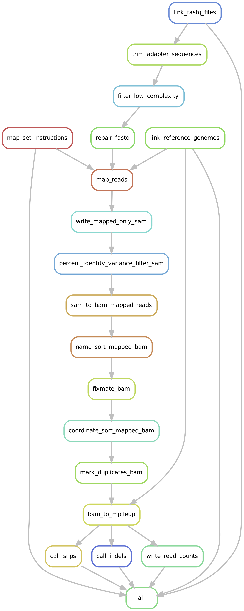

# ViroSearch

## Project Overview

> **Warning**
> This resource is intended for purely research purposes. It should not be used for emergencies or medical or professional advice.

Here we provide a self-contained suite of tools to download and index reference genome sequences of interest, map paired-end short read sequence data against multiple reference genomes, and subsequently call single nucleotide variants (SNVs) and small insertion/deletions (INDELs). The variant calling portion of **ViroSearch** is written using [Snakemake](https://snakemake.readthedocs.io/en/stable/), which provides a robust, reproducible method for analyzing large-scale genomic data sets. The **ViroSearch** code-base and underlying dependencies are provided as a [Docker](https://www.docker.com/) image; no installation is required by the end-user.

While the impetuous for developing **ViroSearch** was to study Epstein Barr Virus (EBV) associated sequence variants within hundreds of samples derived from patients with post-transplant lymphoproliferative disorders (PTLDs), the **ViroSearch** suite of tools provides a generic platform for downloading other reference genomes and calling sample-associated variants. 

> **Note**
> We are currently adding support for custom databases of EBV-related variants associated with published biological functions, as well as tools to intersect, review, and assess variants across a given cohort of samples.

## Abstract

Metagenomic shotgun sequencing (MSS) is a powerful tool to study human viruses and their roles in acute and chronic infections, providing the sensitivity to highlight nucleotide-level variation among viruses. The subsequent time and personnel required to impute the biological significance of such sequence variants is a bottleneck in analysis, historically requiring manual literature searches and association with previously established knowledge of related sequence data.

We have designed and implemented a computational pipeline called **ViroSearch** for the automated search and characterization of variant virus sequences of potential biological interest within large-scale genomic data sets. **ViroSearch** utilizes an extensible, custom database of virus variants associated with published biological functions. Potentially novel variants within sequences are also described. Reports indicate whether variant loci lead to synonymous, non-synonymous, or nonsense changes and within which annotated gene they fall. **ViroSearch** reports also collate sequence variant information at the sample level—e.g. reference genome coverage metrics, number of variants presence, and variant read frequencies within sample.

As an example of the utility of **ViroSearch**, we analyzed Epstein Barr Virus (EBV) associated sequence variants within 42 samples derived from patients with post-transplant lymphoproliferative disorders (PTLDs). PTLDs have high morbidity and mortality rates, but it is not clear what clinical or epidemiological features associate with poor outcomes. As part of the ongoing NIH-funded PTLD-MSMS study of several hundred PTLD tissues, our goal is to apply **ViroSearch** in determining whether EBV sequence variants associate with specific clinical outcomes. In this initial analysis, we demonstrate that **ViroSearch** can identify EBV genomic variants, annotate them, and determine whether they are associated with published biological functions.

**Citation**

> Todd N. Wylie, Madison Eschbach, Haley Gula, Vikas R. Dharnidharka, Kristine M. Wylie \
*"An automated approach to Epstein Barr Virus variant interpretation in PTLD-derived next-generation sequences as presented by the PTLD-MSMS group." \
American Society for Virology* \
The University of Wisconsin-Madison Madison, Wisconsin \
July 16-20, 2022

## Future Directions

**ViroSearch** is under active development and expansion. As part of the PTLD-MSMS (metagenomic shotgun microbial sequencing in post-transplant lymphoproliferative disorders) project, we will be processing a large number of MSS samples from PTLD patients, analyzing sequence data for virus characterization, and determining variant sequence loci for EBV positive samples. As this effort progresses, we will be extending the **ViroSearch** suite of tools to facilitate these efforts. A brief list of additional future functionality follows.

+ Add a command (`virosearch varcallse`) for preparing single-end sequence FASTQ data.
+ Extend code to support adding and indexing a custom reference genome (FASTA) not derived from an Entrez accession id.
+ Add support for generating reference genome coverage metrics based on mapped and filtered reads.
+ Add extensive methods for intra-sample variant loci intersection and reporting; likewise, add support for reporting on variants-of-interest given a **ViroSearch** variant DB file.


# Getting Started

## Target Audience

We assume that an end-user has a general background in running bioinformatics workflows from the command line interface; also, general familiarity with running applications using Docker is required.

## Inputs and Data Types

The **ViroSearch** suite of tools expects paired-end, short read sequences. We have developed and tested **ViroSearch** using Illumina paired-end (100-150 bp) reads from Metagenomic Shotgun Sequencing (MSS) samples. Expected input files are paired (R1/R2) FASTQ files, either gzipped or uncompressed.

For examples, see:

[example/fastq/](example/fastq/)	

## EBV Genome References

We provide two EBV RefSeq reference genomes indexed and ready for use with **ViroSearch**, namely:

+ NC_007605.1 Human gammaherpesvirus 4, complete genome
+ NC_009334.1 Human herpesvirus 4, complete genome

These files may be obtained by downloading the following directory:

[ref_EBV/](ref_EBV/)

These references may also be reconstructed independently using the following commands.

**Command:**

```zsh
docker container run -v $PWD:/pwd twylie/virosearch:latest virosearch getref --email 'twylie@wustl.edu' --virosearch-db /pwd/REFS --acc-id 'NC_007605.1' 'NC_009334.1'
docker container run -v $PWD:/pwd twylie/virosearch:latest virosearch indexref --virosearch-db /pwd/REFS
```

See [virosearch getref](https://github.com/twylie/virosearch#virosearch-getref) and [Example Data Processing](https://github.com/twylie/virosearch#example-data-processing) for more examples of setting up reference genomes for **ViroSearch**.

## Other Genome References

Other genome reference files may also be added to a **ViroSearch** DB reference directory for downstream processing. See [virosearch getref](https://github.com/twylie/virosearch#virosearch-getref) for options for setting up reference genomes for **ViroSearch**.

## Docker

**Docker Containers**

The **ViroSearch** pipeline, and all of its underlying code dependencies, are provided as a [Docker](https://www.docker.com/) image. Once you have installed Docker on your computer and have downloaded the **ViroSearch** Docker image, you will be able to run pipeline containers.

*What are containers?*

>"A container is a standard unit of software that packages up code and all its dependencies so the application runs quickly and reliably from one computing environment to another. A Docker container image is a lightweight, standalone, executable package of software that includes everything needed to run an application: code, run time, system tools, system libraries and settings." (Source: [What is a container?](https://www.docker.com/resources/what-container/))

Docker containers are an easy, pragmatic way to package and deliver software, and have been widely adopted for local and cloud-bases computing. Using a Docker image means we’ve done all of the setup (dependency installation, environment variables, etc.) for you! However, you will need to install Docker on your system before taking advantage of the **ViroSearch** pipeline image.

To install Docker Desktop for your particular system, please visit:

[Get Started with Docker](https://www.docker.com/get-started/)

and download the appropriate version for your computer. Follow Docker’s instructions for installing and starting Docker Desktop.

Docker’s own tutorials are a good place to start familiarizing yourself with Docker and running Docker containers.

[Play with Docker](https://www.docker.com/play-with-docker/)

An in depth overview of Docker is beyond the scope of this documentation; however, there are many other resources, tutorials, and walk-throughs related to Docker online. We will cover Docker basics for running the **ViroSearch** pipeline throughout this documentation.

## Download the ViroSearch Docker Image

**ViroSearch Docker Image**

While the **ViroSearch** code base is hosted at [https://github.com/twylie/virosearch](https://github.com/twylie/virosearch), we only support using the official Docker image. Docker Desktop is required on your computer in order to run **ViroSearch** containers. All required code and third party dependencies are included in the **ViroSearch** Docker image. Once you’ve installed Docker Desktop (and the Docker service is running on your system) you will be able to download the **ViroSearch** Docker image. To test that Docker Desktop is installed and running correctly on your computer, you may type the following in a terminal.

**Command:**

```zsh
docker --version
```

**Results:**

```plaintext
Docker version 20.10.13, build a224086
```

The latest version of **ViroSearch** is provided via DockerHub. Once you’ve installed Docker Desktop (and the Docker service is running on your system) you will be able to download and run the **ViroSearch** Docker image. Specifically, you want the `virosearch:latest` image.

To download and install **ViroSearch** into Docker service, type the following in your terminal.

**Command:**

```zsh
docker pull twylie/virosearch:latest
```

The command above will contact DockerHub to download and register the **ViroSearch** image on your system. This process can take several minutes. Once installed, you will be able to run **ViroSearch** pipeline containers on your computer. Type the following to see if your download was successful.

**Command:**

```zsh
docker images twylie/virosearch:latest
```

You should see a message that indicating that youe have downloaded and registered the **ViroSearch** docker image on your system.

To get the **ViroSearch** version number of the installed Docker image, type the following from a terminal.

**Command:**

```zsh
docker container run twylie/virosearch:latest virosearch --version
```

**Results:**

```plaintext
ViroSearch (Revision 18)
```

## System Resources and Benchmarks

In terms of disk space and memory, requirements vary depending on the size and complexity of the samples you are processing. We have run **ViroSearch** on pilot samples, ranging from 370 thousand to over 43 million reads processed per sample. A pilot sample review of 81 samples (~700 million total reads) was run through the variant calling portion of **ViroSearch** with 16 GB of memory and 50 GB of output disk space in 1:06 run time across 100 cluster jobs.

General resources and benchmarks are outlined on this page as broad guidelines. It is not possible to give exact requirements for resources---e.g. processing time, memory, disk space---*a priori*, as these resources are highly dependent on the viral complexity of the sequencing reads being evaluated. If a very large portion of the reads are viral, then processing will likely take longer and use more resources when compared to a sample with fewer viral reads.

**Memory**

As a general rule of thumb, we recommend starting with 16 GB of memory.

**Disk Space**

Disk space needed for **ViroSearch** processing can be considerable depending on the number of reads processed per sample, especially if the `--notemp` flag is passed to [Snakemake](https://snakemake.readthedocs.io/en/stable/) when executing the variant calling pipeline. A very rough estimation is to plan to start withh 25-50 Gb of **intermediate** output disk space for each for every 100 million reads evaluated.

**Parallel Processing**

Attempting to automate cluster processing for multiple off-site architectures is beyond the scope of this project; however, the default Snakemake setup provided by ViroSearch is a good starting point for customization to run in parallel on your own cluster environment. Inherent in Snakmake's DAG approach is the ability to run atomic processes independently. For users running **ViroSearch** at Washington University School of Medicine, parallel processing is supported---see [virosearch washupp](https://github.com/twylie/virosearch#virosearch-washupp) and [Example Data Processing WashU Cluster](https://github.com/twylie/virosearch#example-data-processing-washu-cluster) for details.

## Test Data Set and Sample Key

We provide a small Metagenomic Shotgun Sequencing (MSS) test set of 100,000 paired-end reads containing EBV virus sequences for testing the **ViroSearch** pipeline, along with a corresponding sample key.

You may download the test FASTQ files and associated sample key here:

[example/fastq/](example/fastq/) \
[example/pe_samples.tsv](example/pe_samples.tsv)

To run the sample key and corresponding test data through the **ViroSearch** pipeline, see [Tutorials](https://github.com/twylie/virosearch#tutorials).

## Recommended Parameters for EBV Variant Calling

Read filtering and variant calling parameters can have a very large affect on the number of potential variants called on a sample. Reference genome complexity---e.g. repeat content, nucleotide distribution, rearrangements---can also contribute to potential false positive variant rates. Requirements for read-depth coverage prior to calling variants can also help weed out potential noise. For these reasons, **ViroSearch** tools have many options and settings (see [virosearch varcallpe Arguments](https://github.com/twylie/virosearch#arguments-2) for related options).

For example, the most lenient version of running the pipeline would skip read preparation and filtering, skip percent identity variance filtering for mapped reads, would not deduplicate mapped reads, promotes all SAM/BAM mapped read types to variant calling, and runs all variant calling parameters at their default. We would expect the following settings to produce some percentage of false positive variant calls:

**Command:**

```zsh
# Aggressive variant calling:
virosearch varcallpe \
--virosearch-db ref_EBV/ \
--results-dir RESULTS \
--sample-key pe_samples.tsv \
--no-trim \
--no-lcf \
--no-pidv \
--no-dedup
```

However, based on our assessment of pilot data, **we use the following for calling SNPs and small INDELs against the EBV reference genomes**. You may change parameters to be more or less stringent as you see fit for your own needs.

**Command:**

```zsh
# EBV-specific variant calling:
virosearch varcallpe \
--virosearch-db ref_EBV \
--results-dir RESULTS \
--sample-key pe_samples.tsv \
--no-secondary \
--snp-min-var-freq 0.80 \
--indel-min-var-freq 0.80 \
--snp-min-coverage 10 \
--indel-min-coverage 10 \
--snp-min-reads2 8 \
--indel-min-reads2 8
```


# Tutorials

## Docker

### Mapping Docker Volumes

Regardless of whether you use an interactive session or command line execution, you will need to map your local directories to the Docker container. Once inside a container, Docker doesn’t understand your local file system unless you explicitly tell it how things are mapped. The volume mapping convention is of the form `/local:/container`---i.e. we are mapping a local directory to an alias that will point to the directory within the Docker container, as passed on the command line using the `-v` option. All local directories that you wish Docker to see must be mapped in this way. 

See [Docker Use Volumes](https://docs.docker.com/storage/volumes/) for examples of how Docker `-v` volume mapping is accomplished.

> **Warning**
> Most errors encountered when running the pipeline stem from malformed volume mappings when executing the docker container run command. Make sure you are exact when providing volume mappings and use fully qualified paths to be explicit.

### Docker Execution

We can run **ViroSearch** from a container instance without being in an interactive shell, akin to a standard command in the terminal. Docker will alos allow a user to enter an interactive session (shell) when running a container. In such a scenario, we first enter an interactive instance of the **ViroSearch** Docker image and then execute our **ViroSearch** commands. This approach can be very useful for interacting directly with the **ViroSearch** code base, running sub-commands manually, or troubleshooting. When running the pipeline using this method, we see standard output on the screen in real time. Since the session (and window) must remain open throughout pipeline processing, this method is not the best choice for long running jobs or if one is wanting to submit the job within a cluster. 

It is also possible to execute a Docker job from the command line and run it completely in the background. Just add the `-d` switch to your docker command to *detach* the job. You will be given a job ID to monitor the job. This is the preferred method for long-running **ViroSearch** jobs on a local system.

For details on running Docker sessions, see: 

+ [Running Containers](https://hsf-training.github.io/hsf-training-docker/03-running-containers/index.html)
+ [How to Use the docker run Command](https://phoenixnap.com/kb/docker-run-command-with-examples)
+ [Docker Container Run](https://docs.docker.com/engine/reference/commandline/container_run/)

## Example Data Processing

Instructions for downloading and running the test EBV-positive MSS sample through the **ViroSearch** variant calling pipeline follow. In this example, we will download the test EBV data, associate a sample key, and call variants against two RefSeq EBV reference genomes.

You should have Docker Desktop and the **ViroSearch** Docker image installed on your system prior to running these commands---see [Docker](https://github.com/twylie/virosearch#docker), [Download the ViroSearch Docker Image](https://github.com/twylie/virosearch#download-the-virosearch-docker-image), and [Tutorials: Docker](https://github.com/twylie/virosearch#docker-1).

Steps:

1. Download the EBV Reference Genomes
2. Download Test Sequencing Data
3. Download the Test Sample Key
4. Run **ViroSearch** Commands

Download **ViroSearch** code and example test data from GithHub, using `git` from the command line.

**Command:**

```zsh
git clone https://github.com/twylie/virosearch.git
cd virosearch/
```

Within the GitHub download:

+ The EBV references will be located in the `ref_EBV/` directory.
+ Test MSS sequences will be located under the `example/fastq/` directory: `example/fastq/sample1.100k.r1.fastq.gz`; `example/fastq/sample1.100k.r2.fastq.gz`.
+ The test sample key path is: `example/pe_samples.tsv`.

Now make a directory on your system within the directory you just downloaded from GitHub and copy all of the required reagent files there.

**Command:**

```zsh
# git clone https://github.com/twylie/virosearch.git
# cd virosearch/
mkdir testing
cd testing/
cp -pr ../ref_EBV .
cp ../example/pe_samples.tsv .
cp ../example/fastq/*gz .
```

After copying in the test files, your testing/ directory will look like this:

```plaintext
testing/
├── pe_samples.tsv
├── ref_EBV
│   └── referencesDB
│       ├── NC_007605.1
│       │   ├── NC_007605.1.cds.faa
│       │   ├── NC_007605.1.cds.fna
│       │   ├── NC_007605.1.fna
│       │   ├── NC_007605.1.fna.amb
│       │   ├── NC_007605.1.fna.ann
│       │   ├── NC_007605.1.fna.bwt
│       │   ├── NC_007605.1.fna.cmd
│       │   ├── NC_007605.1.fna.fai
│       │   ├── NC_007605.1.fna.pac
│       │   ├── NC_007605.1.fna.sa
│       │   └── NC_007605.1.gbk
│       └── NC_009334.1
│           ├── NC_009334.1.cds.faa
│           ├── NC_009334.1.cds.fna
│           ├── NC_009334.1.fna
│           ├── NC_009334.1.fna.amb
│           ├── NC_009334.1.fna.ann
│           ├── NC_009334.1.fna.bwt
│           ├── NC_009334.1.fna.cmd
│           ├── NC_009334.1.fna.pac
│           ├── NC_009334.1.fna.sa
│           └── NC_009334.1.gbk
├── sample1.100k.r1.fastq.gz
└── sample1.100k.r2.fastq.gz

4 directories, 24 files
```

We may now prepare a directory for **ViroSearch** variant callin from within the `testing/` directory we just made. Note that the test sample key paths for the fastq files are as follows.

```plaintext
TestSampleOne   NC_007605.1 NC_009334.1 /testing/sample1.100k.r1.fastq.gz       /testing/sample1.100k.r2.fastq.gz
```

This means that we will need to map the `testing/` directory to `/testing` on the Docker container side of things, so that the FASTQ files are found by Docker.

**Command:**

```zsh
# From within testing/ directory:
docker container run -v $PWD:/testing twylie/virosearch:latest virosearch varcallpe --virosearch-db /testing/ref_EBV --results-dir /testing/RESULTS --sample-key /testing/pe_samples.tsv --no-secondary --snp-min-var-freq 0.80 --indel-min-var-freq 0.80 --snp-min-coverage 10 --indel-min-coverage 10 --snp-min-reads2 8 --indel-min-reads2 8
```

**Results:**

```plaintext
[virosearch varcallpe] (execute_var_call_pe_cmd) --- BEGIN
[virosearch VarCallPE] (eval_dir_db) --- Evaluating the ViroSearch DB directory.
[virosearch VarCallPE] (eval_dir_db) --- Parent ViroSearch DB directory present.
[virosearch VarCallPE] (eval_dir_db) --- Evaluating --virosearch-db: /testing/ref_EBV
[virosearch VarCallPE] (eval_dir_db) --- ViroSearch referencesDB directory present.
[virosearch VarCallPE] (eval_reference_indexes) --- Review BWA MEM indexing of references.
[virosearch VarCallPE] (eval_reference_indexes) --- BWA MEM indexes exist: NC_007605.1
[virosearch VarCallPE] (eval_reference_indexes) --- BWA MEM indexes exist: NC_009334.1
[virosearch VarCallPE] (make_processing_outdir) --- Making the processing outdir directory.
[virosearch VarCallDir] (make_directory) --- Creating new outdir processing directory.
[virosearch VarCallPE] (make_smk_dir) --- Making the Snakemale processing directory.
[virosearch VarCallSmkDirPE] (make_directory) --- Creating new Snakemake processing directory: /testing/RESULTS/smk
[virosearch VarCallPE] (eval_samplekey) --- Evaluating the provided samplekey.
[virosearch VarCallPE] (eval_samplekey) --- Samplekey file is present.
[virosearch VarCallSampleKey] (populate_samples) --- Provided sample ids are uniqued.
[virosearch VarCallSampleKey] (populate_samples) --- Samplekey information populated.
[virosearch VarCallSampleKey] (eval_reference_ids) --- Reference id NC_007605.1 is a match.
[virosearch VarCallSampleKey] (eval_reference_ids) --- Reference id NC_009334.1 is a match.
[virosearch VarCallSampleKey] (eval_pe_samplekey_format) --- Passed samplekey format evaluation.
[virosearch VarCallSampleKey] (write_samplekey_tsv_file) --- Wrote samplekey to processing directory.
[virosearch VarCallPE] (write_config_file) --- Writing the YAML configuration file.
[virosearch VarCallConfig] (populate_arguments) --- Config populated with CLI arguments.
[virosearch VarCallConfig] (write_config_file) --- Wrote YAML configuration: /testing/RESULTS/config.yaml
[virosearch VarCallPE] (copy_varcallpe_recipe) --- Copying the Snakefile recipe for pipeline execution.
[virosearch VarCallPE] (write_example_smk_cmd) --- Write an example Snakemake pipeline execution command. [cmd.sh]
[virosearch VarCallPE] (write_example_smk_cmd) --- Making the example command executable.
[virosearch varcallpe] (execute_var_call_pe_cmd) --- END
```

The variant calling files have been setup within the `--results-dir` directory. We may now execute the Snakmake command to run the variant calling pipeline.

**Command:**

```zsh
# From within testing/ directory:
docker container run -v $PWD:/testing twylie/virosearch:latest /testing/RESULTS/cmd.sh
```

**Results:**

[View the Snakemake log from the command above.](docs/tutorial_snakemake_output.txt)

Of note, we executed the Snakemake pipeline via the `cmd.sh` script; however, you may edit and manually run the Snakemake command directly from the command line, if desired. For example, you could add the `--notemp` flag to the Snakmake command to retain intermediate files created by the pipeline.

**Command:**

```zsh
snakemake --snakefile /testing/RESULTS/varcallpe.smk --configfile /testing/RESULTS/config.yaml --cores=1 -p --notemp
```

Resultant pipeline output files are located here.

**Command:**

```zsh
ls -ald testing/RESULTS/smk/*
```

**Results:**

```plaintext
RESULTS/smk/01_map_set_instructions/
RESULTS/smk/02_link_reference_genomes/
RESULTS/smk/03_link_fastq_files/
RESULTS/smk/04_trim_adapter_sequences/
RESULTS/smk/05_filter_low_complexity/
RESULTS/smk/06_repair_fastq/
RESULTS/smk/07_map_reads/
RESULTS/smk/08_write_mapped_only_sam/
RESULTS/smk/09_percent_identity_variance_filter_sam/
RESULTS/smk/10_sam_to_bam_mapped_reads/
RESULTS/smk/11_name_sort_mapped_bam/
RESULTS/smk/12_fixmate_bam/
RESULTS/smk/13_coordinate_sort_mapped_bam/
RESULTS/smk/14_mark_duplicates_bam/
RESULTS/smk/15_bam_to_mpileup/
RESULTS/smk/16_call_snps/
RESULTS/smk/17_call_indels/
RESULTS/smk/18_write_read_counts/
```

Variant-specific output files are here:

+ RESULTS/smk/16_call_snps/TestSampleOne__NC_007605.1.snps.vcf
+ RESULTS/smk/16_call_snps/TestSampleOne__NC_009334.1.snps.vcf
+ RESULTS/smk/17_call_indels/TestSampleOne__NC_007605.1.indels.vcf
+ RESULTS/smk/17_call_indels/TestSampleOne__NC_009334.1.indels.vcf
+ RESULTS/smk/18_write_read_counts/TestSampleOne__NC_007605.1.counts
+ RESULTS/smk/18_write_read_counts/TestSampleOne__NC_009334.1.counts

## Example Data Processing WashU Cluster

> **Warning**
> WARNING!!! This tutorial is only for users at Washington University School of Medicine. It is tailored for parallel processing using the LSF system at RIS.

Instructions for downloading and running the test MSS sample through the **ViroSearch** variant calling pipeline follows. In this example, we will download the test data, associate a sample key, setup parallel processing, and call variants against two RefSeq EBV reference genomes.

1. Download the EBV Reference Genomes
2. Download Test Sequencing Data
3. Download the Test Sample Key
4. Run **ViroSearch** Commands

Log into one of the RIS compute servers.

**Command:**

```zsh
ssh compute1-client-1.ris.wustl.edu
```

Change directory to fast (**scratch1**) disk space in your user-defined area.

**Command:**

```zsh
cd /scratch1/fs1/twylie/
```

Download **ViroSearch** code and example test data from GithHub.

**Command:**

```zsh
git clone https://github.com/twylie/virosearch.git
cd virosearch/
```

Within the GitHub download:

+ The EBV references will be located in the `ref_EBV/` directory.
+ Test MSS sequences will be located under the `example/fastq/` directory: `example/fastq/sample1.100k.r1.fastq.gz`; `example/fastq/sample1.100k.r2.fastq.gz`.
+ The test sample key path is: `example/pe_samples.tsv`.

Now make a `testing/` directory on your system within the directory you just downloaded from GitHub and copy all of the required reagent files there.

**Command:**

```zsh
# git clone https://github.com/twylie/virosearch.git
# cd virosearch/
mkdir testing
cd testing/
cp -pr ../ref_EBV .
cp ../example/pe_samples.tsv .
cp ../example/fastq/*gz .
```

After copying in the test files, your `testing/` directory will look like this.

```plaintext
testing/
├── pe_samples.tsv
├── ref_EBV
│   └── referencesDB
│       ├── NC_007605.1
│       │   ├── NC_007605.1.cds.faa
│       │   ├── NC_007605.1.cds.fna
│       │   ├── NC_007605.1.fna
│       │   ├── NC_007605.1.fna.amb
│       │   ├── NC_007605.1.fna.ann
│       │   ├── NC_007605.1.fna.bwt
│       │   ├── NC_007605.1.fna.cmd
│       │   ├── NC_007605.1.fna.fai
│       │   ├── NC_007605.1.fna.pac
│       │   ├── NC_007605.1.fna.sa
│       │   └── NC_007605.1.gbk
│       └── NC_009334.1
│           ├── NC_009334.1.cds.faa
│           ├── NC_009334.1.cds.fna
│           ├── NC_009334.1.fna
│           ├── NC_009334.1.fna.amb
│           ├── NC_009334.1.fna.ann
│           ├── NC_009334.1.fna.bwt
│           ├── NC_009334.1.fna.cmd
│           ├── NC_009334.1.fna.pac
│           ├── NC_009334.1.fna.sa
│           └── NC_009334.1.gbk
├── sample1.100k.r1.fastq.gz
└── sample1.100k.r2.fastq.gz

4 directories, 24 files
```

We will need to update the `pe_samples.tsv` sample key to reflect volume paths. Edit the `pe_samples.tsv` file to look as follows:

```plaintext
TestSampleOne	NC_007605.1 NC_009334.1	/scratch1/fs1/twylie/testing/sample1.100k.r1.fastq.gz	/scratch1/fs1/twylie/testing/sample1.100k.r2.fastq.gz
```

Setup the **ViroSearch** processing directory for running the variant calling pipeline. We need to pick a **storage1** volume to write all of the pipeline files. We will run the pipeline from **scratch1** space, but will write pipeline files to **storage1**. I've chosen the following **storage1** area to write my pipeline files:

```plaintext
/storage1/fs1/PTLD/Active/twylie/testing/smk
```

Get an interactive Docker session to setup the processing directory. Run the `virosearch varcallpe` command. We also need to extend the **ViroSearch** processing directory to run at WashU in cluster-mode. Finally, exit out of this interactive Docker session.

> **Note**
> Be sure to pass your home directory path to `--docker-volumes` along with any volumes that will be used in the pipeline. Snakemake will need to see your home directory when running.

**Command:**

```zsh
LSF_DOCKER_VOLUMES='/storage1/fs1/PTLD/Active/twylie:/storage1/fs1/PTLD/Active/twylie /scratch1/fs1/twylie:/scratch1/fs1/twylie' bsub -Is -G compute-twylie -q general-interactive -a 'docker(twylie/virosearch:latest)' zsh
cd /scratch1/fs1/twylie/testing/
virosearch varcallpe --virosearch-db '/scratch1/fs1/twylie/testing/ref_EBV' --results-dir '/scratch1/fs1/twylie/testing/RESULTS' --sample-key '/scratch1/fs1/twylie/testing/pe_samples.tsv' --smk-dir '/storage1/fs1/PTLD/Active/twylie/testing/smk' --no-secondary --snp-min-var-freq 0.80 --indel-min-var-freq 0.80 --snp-min-coverage 10 --indel-min-coverage 10 --snp-min-reads2 8 --indel-min-reads2 8
virosearch washupp --results-dir '/scratch1/fs1/twylie/testing/RESULTS' --lsf-compute-group 'compute-twylie' --docker-volumes '/home/twylie' '/scratch1/fs1/twylie' '/storage1/fs1/PTLD/Active'
exit
```

**Results:**

```plaintext
[virosearch varcallpe] (execute_var_call_pe_cmd) --- BEGIN
[virosearch VarCallPE] (eval_dir_db) --- Evaluating the ViroSearch DB directory.
[virosearch VarCallPE] (eval_dir_db) --- Parent ViroSearch DB directory present.
[virosearch VarCallPE] (eval_dir_db) --- Evaluating --virosearch-db: /scratch1/fs1/twylie/testing/ref_EBV
[virosearch VarCallPE] (eval_dir_db) --- ViroSearch referencesDB directory present.
[virosearch VarCallPE] (eval_reference_indexes) --- Review BWA MEM indexing of references.
[virosearch VarCallPE] (eval_reference_indexes) --- BWA MEM indexes exist: NC_007605.1
[virosearch VarCallPE] (eval_reference_indexes) --- BWA MEM indexes exist: NC_009334.1
[virosearch VarCallPE] (make_processing_outdir) --- Making the processing outdir directory.
[virosearch VarCallDir] (make_directory) --- Creating new outdir processing directory.
[virosearch VarCallPE] (make_smk_dir) --- Making the Snakemale processing directory.
[virosearch VarCallSmkDirPE] (make_directory) --- Creating new Snakemake processing directory: /storage1/fs1/PTLD/Active/twylie/testing/smk
[virosearch VarCallPE] (eval_samplekey) --- Evaluating the provided samplekey.
[virosearch VarCallPE] (eval_samplekey) --- Samplekey file is present.
[virosearch VarCallSampleKey] (populate_samples) --- Provided sample ids are uniqued.
[virosearch VarCallSampleKey] (populate_samples) --- Samplekey information populated.
[virosearch VarCallSampleKey] (eval_reference_ids) --- Reference id NC_007605.1 is a match.
[virosearch VarCallSampleKey] (eval_reference_ids) --- Reference id NC_009334.1 is a match.
[virosearch VarCallSampleKey] (eval_pe_samplekey_format) --- Passed samplekey format evaluation.
[virosearch VarCallSampleKey] (write_samplekey_tsv_file) --- Wrote samplekey to processing directory.
[virosearch VarCallPE] (write_config_file) --- Writing the YAML configuration file.
[virosearch VarCallConfig] (populate_arguments) --- Config populated with CLI arguments.
[virosearch VarCallConfig] (write_config_file) --- Wrote YAML configuration: /scratch1/fs1/twylie/testing/RESULTS/config.yaml
[virosearch VarCallPE] (copy_varcallpe_recipe) --- Copying the Snakefile recipe for pipeline execution.
[virosearch VarCallPE] (write_example_smk_cmd) --- Write an example Snakemake pipeline execution command. [cmd.sh]
[virosearch VarCallPE] (write_example_smk_cmd) --- Making the example command executable.
[virosearch varcallpe] (execute_var_call_pe_cmd) --- END

[virosearch washupp] (execute_washupp_cmd) --- BEGIN
[virosearch VarCallDir] (load_directory) --- Loading variant calling results directory.
[virosearch VarCallDir] (load_directory) --- Passed results directory evaluation step.
[virosearch VarCallWashu] (make_lsf_logs_directory) --- Evaluating LSF log directory settings.
[virosearch VarCallWashu] (make_lsf_logs_directory) --- Attempting default LSF log directory within results directory.
[virosearch VarCallWashu] (make_lsf_logs_directory) --- Writing default LSF log directory. [lsf_logs]
[virosearch VarCallWashu] (copy_submit_lsf_script) --- Copying LSF submission script to results directory.
[virosearch VarCallWashu] (write_yaml_config_file) --- Writing WashU YAML configuration file.
[virosearch VarCallWashuConfig] (populate_arguments) --- WashU config populated with CLI arguments.
[virosearch VarCallWashuConfig] (write_config_file) --- Wrote WashU YAML configuration: /scratch1/fs1/twylie/testing/RESULTS/washu.yaml
[virosearch VarCallWashu] (write_example_smk_cmd) --- Write an example WashU Snakemake pipeline execution command. [washu.sh]
[virosearch VarCallWashu] (write_example_smk_cmd) --- Making the WashU example command executable.
[virosearch washupp] (execute_washupp_cmd) --- END
```

We are now ready to launch the head-node Snakemake command. Be sure you have exited out of any interactive Docker sessions. We must map our home directory for Snakemake, as well as any volumes that contain our data or directories that we have setup for writing results.

**Command:**

```zsh
# Exit from any interactive Docker sessions and run from a native shell.
cd /scratch1/fs1/twylie/testing/RESULTS/
LSF_DOCKER_VOLUMES='/home/twylie:/home/twylie /scratch1/fs1/twylie:/scratch1/fs1/twylie /storage1/fs1/PTLD/Active:/storage1/fs1/PTLD/Active' bsub -M 16G -R "select[mem>16G] rusage[mem=16G]" -G compute-twylie -q general -e $PWD/LSF.err -o $PWD/LSF.out -a 'docker(twylie/virosearch:latest)' $PWD/washu.sh
```

Jobs are now submitted to LSF via the Snakemake command. Jobs that can be run in parallel will be processed as such. Check the `LSF.err` and `LSF.out` processing logs (as well as `bjobs`) for progress. The `lsf_logs/` directory will contain child process logs. By default, we ran a possible 100 jobs in parallel when setting up with the `virosearch washupp` command---see [virosearch washupp](https://github.com/twylie/virosearch#virosearch-washupp) and [Example Data Processing WashU Cluster](https://github.com/twylie/virosearch#example-data-processing-washu-cluster) for changing LSF parameters. The `LSF.err` can also show the progress of the Snakemake pipeline and executed steps.


# ViroSearch Commands

## Running Commands

**ViroSearch** is a suite of tools that may be run from the command line interface. You may run **ViroSearch** commands in an interactive Docker session or as a Docker mediated command. See [Docker](https://github.com/twylie/virosearch#docker), [Download the ViroSearch Docker Image](https://github.com/twylie/virosearch#download-the-virosearch-docker-image), and [Tutorials: Docker](https://github.com/twylie/virosearch#docker-1) for details on running Docker. After you have downloaded the latest **ViroSearch** Docker image ([https://github.com/twylie/virosearch](https://github.com/twylie/virosearch)), type the following to see the current list of top-level commands.

**Command:**

```zsh
docker container run twylie/virosearch:latest virosearch --help
```

**Results:**

```plaintext
usage: virosearch [-h] [--version] {getref,indexref,washupp,varcallpe} ...

*** VIROSEARCH ***

optional arguments:
  -h, --help            Display the extended usage statement.
  --version             Display the software version number.

Subcommands::
  
      -- References
         getref         Download reference files from Entrez by acc id.
         indexref       Index reference files in a ViroSearch DB directory.
  
      -- Mapping and Variant Calling
         varcallpe      Paired end mapping and variant calling.
         washupp        WashU Only: Add parallel processing setup.

  {getref,indexref,washupp,varcallpe}
```

Here we see that there are currently four sub-commands under the **ViroSearch** name space:

+ getref
+ indexref
+ varcallpe
+ washupp

Each sub-command may be accessed using the parent `virosearch` command. Example:

**Command:**

```zsh
docker container run twylie/virosearch:latest virosearch getref --help
```

**Results:**

```plaintext
usage: virosearch getref [-h] --email STR --virosearch-db PATH --acc-id STR
                         [STR ...]

*** Download reference files from Entrez. ***

optional arguments:
  -h, --help            show this help message and exit

required arguments:
  --email STR           The email address to be used when downloading genome
                        sequences and associated metadata. Entrez requires an
                        email address for anonymous connection.
  --virosearch-db PATH  The path to write the resultant ViroSearch DB
                        reference genome directory. May be a new or
                        preexisting directory. An existing directory will
                        trigger evaluation of underlying files and assumes
                        directory extension is desired.
  --acc-id STR [STR ...]
                        Supply a list (space-delimited) of accession ids for
                        all of the reference genome sequences you wish to
                        include in the ViroSearch DB directory. Already
                        existing references will be skipped. Running the
                        getref command multiple times with new accession ids
                        will extend/add references to the ViroSearch DB
                        directory.
```

In the above example, we have run the `getref` sub-command and asked for command line details using the `--help` argument. This lists the general usage statement and available arguments for the `getref` command. Arguments are a convention for setting parameters and providing additional information for command line tools. Some arguments are required while others are optional. Some arguments may have default values defined. It is through the command line arguments that we define the subsequent behavior of a command.

In the above help example, we see there are three required arguments to run the `getref` command: `--email`, `--virosearch-db`, and `--acc-id`. A brief description outlines what each argument is asking for in terms of input. We are also given indications of what type of input is expectd for each argument---e.g. `STR` for text string; `PATH` for file or directory path; `INT` for integer value; `FLOAT` for floating value.

Running a command will produce several lines of text to your screen indicating the resulting status of your command, step by step. While these messages are essentially for reviewing the tandem steps run by the command and troubleshooting, import information will also be displayed when a decision is made or a problem is encountered.

**Command:**

```zsh
docker container run -v $PWD:/pwd twylie/virosearch:latest virosearch getref --email 'twylie@wustl.edu' --virosearch-db /pwd/REFS --acc-id 'NC_009334.1'
```

**Results:**

```plaintext
[virosearch getref] (execute_get_ref_cmd) --- BEGIN
[virosearch GetRef] (make_db_dir) --- Assessing database directory.
[virosearch GetRef] (make_db_dir) --- Making directory: /pwd/REFS
[virosearch GetRef] (make_db_dir) --- Making directory: /pwd/REFS/referencesDB
[virosearch GetRef] (download_entrez_references) --- Downloading data from Entrez.
[virosearch GetRef] (download_genbank) --- Making directory: /pwd/REFS/referencesDB/NC_009334.1
[virosearch GetRef] (download_genbank) --- Downloading GenBank file: NC_009334.1
[virosearch GetRef] (download_genbank) --- Wrote GenBank file: /pwd/REFS/referencesDB/NC_009334.1/NC_009334.1.gbk
[virosearch GetRef] (download_cds_amino_acid) --- Downloading CDS amino acid file: NC_009334.1
[virosearch GetRef] (download_cds_amino_acid) --- Wrote cds.faa file: /pwd/REFS/referencesDB/NC_009334.1/NC_009334.1.cds.faa
[virosearch GetRef] (download_cds_nucleotide) --- Downloading CDS nucleotide file: NC_009334.1
[virosearch GetRef] (download_cds_nucleotide) --- Wrote cds.fna file: /pwd/REFS/referencesDB/NC_009334.1/NC_009334.1.cds.fna
[virosearch GetRef] (download_refseq) --- Downloading RefSeq nucleotide file: NC_009334.1
[virosearch GetRef] (download_refseq) --- Wrote RefSeq file: /pwd/REFS/referencesDB/NC_009334.1/NC_009334.1.fna
[virosearch getref] (execute_get_ref_cmd) --- END
```

For example, the getref command above shows that the `--virosearch-db` path provided already existed and sequence files for NC_009334.1 are present---so no actions were required for this accession id.

> **Note**
> Reading the output statements after running a `virosearch` command is good practice.

## ViroSearch Sub-Commands

### virosearch getref

The **ViroSearch** `getref` command is used to generate a structured **ViroSearch** DB directory that will contain reference genome sequences and associated metadata. This is essentially the first step in working with **ViroSearch** tools, as at least one reference genome sequence will be needed to map reads reads and call variants. Once created, this directory may be provided to other **ViroSearch** commands using the `--virosearch-db` argument. For a given accession id, **ViroSearch** will download the following file types from Entrez if available: `ACCID.fna` (nucleotide version of genome sequence); `ACCID.cds.fna` (nucleotide version of coding sequences); `ACCID.cds.faa` (translated version of coding sequences); `ACCID.gbk` (GenBank file for the reference).

View the current arguments for `virosearch getref` command:

**Command:**

```zsh
docker container run twylie/virosearch:latest virosearch getref --help
```

#### Arguments

**Command**|**Argument**|**Format**|**Required**|**Default**|**Description**
:-----:|:-----:|:-----:|:-----:|:-----:|:-----:
virosearch getref|help|FLAG|no|N/A|Displays usage statement and detailed help information.
virosearch getref|email|STR|yes|N/A|The email address to be used when downloading genome sequences and associated metadata. Entrez requires an email address for anonymous connection.
virosearch getref|virosearch-db|PATH|yes|N/A|The path to write the resultant ViroSearch DB reference genome directory. May be a new or preexisting directory. An existing directory will trigger evaluation of underlying files and assumes directory extension is desired.
virosearch getref|acc-id|STR|yes|N/A|Supply a list (space-delimited) of accession ids for all of the reference genome sequences you wish to include in the ViroSearch DB directory. Already existing references will be skipped. Running the getref command multiple times with new accession ids will extend/add references to the ViroSearch DB directory.

#### Example 1

**Command:**

```zsh
docker container run -v $PWD:/pwd twylie/virosearch:latest virosearch getref --email 'twylie@wustl.edu' --virosearch-db /pwd/REFS --acc-id 'NC_009334.1' 'NC_007605.1'
```

**What it does:**

Creates a new **ViroSearch** DB directory called `REFS/` in the present working directory and downloads reference genomes and associated files. Note that we supplied two accession ids here (space-delimited) for downloading two reference genomes at the same time. The `--email` argument is used when downloading the reference genomes, as Entrez requires an email address for downloads; be sure to change this to your own email address when running this command.

**Results:**

```plaintext
[virosearch getref] (execute_get_ref_cmd) --- BEGIN
[virosearch GetRef] (make_db_dir) --- Assessing database directory.
[virosearch GetRef] (make_db_dir) --- Making directory: /pwd/REFS
[virosearch GetRef] (make_db_dir) --- Making directory: /pwd/REFS/referencesDB
[virosearch GetRef] (download_entrez_references) --- Downloading data from Entrez.
[virosearch GetRef] (download_genbank) --- Making directory: /pwd/REFS/referencesDB/NC_009334.1
[virosearch GetRef] (download_genbank) --- Downloading GenBank file: NC_009334.1
[virosearch GetRef] (download_genbank) --- Wrote GenBank file: /pwd/REFS/referencesDB/NC_009334.1/NC_009334.1.gbk
[virosearch GetRef] (download_cds_amino_acid) --- Downloading CDS amino acid file: NC_009334.1
[virosearch GetRef] (download_cds_amino_acid) --- Wrote cds.faa file: /pwd/REFS/referencesDB/NC_009334.1/NC_009334.1.cds.faa
[virosearch GetRef] (download_cds_nucleotide) --- Downloading CDS nucleotide file: NC_009334.1
[virosearch GetRef] (download_cds_nucleotide) --- Wrote cds.fna file: /pwd/REFS/referencesDB/NC_009334.1/NC_009334.1.cds.fna
[virosearch GetRef] (download_refseq) --- Downloading RefSeq nucleotide file: NC_009334.1
[virosearch GetRef] (download_refseq) --- Wrote RefSeq file: /pwd/REFS/referencesDB/NC_009334.1/NC_009334.1.fna
[virosearch GetRef] (download_genbank) --- Making directory: /pwd/REFS/referencesDB/NC_007605.1
[virosearch GetRef] (download_genbank) --- Downloading GenBank file: NC_007605.1
[virosearch GetRef] (download_genbank) --- Wrote GenBank file: /pwd/REFS/referencesDB/NC_007605.1/NC_007605.1.gbk
[virosearch GetRef] (download_cds_amino_acid) --- Downloading CDS amino acid file: NC_007605.1
[virosearch GetRef] (download_cds_amino_acid) --- Wrote cds.faa file: /pwd/REFS/referencesDB/NC_007605.1/NC_007605.1.cds.faa
[virosearch GetRef] (download_cds_nucleotide) --- Downloading CDS nucleotide file: NC_007605.1
[virosearch GetRef] (download_cds_nucleotide) --- Wrote cds.fna file: /pwd/REFS/referencesDB/NC_007605.1/NC_007605.1.cds.fna
[virosearch GetRef] (download_refseq) --- Downloading RefSeq nucleotide file: NC_007605.1
[virosearch GetRef] (download_refseq) --- Wrote RefSeq file: /pwd/REFS/referencesDB/NC_007605.1/NC_007605.1.fna
[virosearch getref] (execute_get_ref_cmd) --- END
```

**Files:**

```plaintext
REFS
└── referencesDB
    ├── NC_007605.1
    │   ├── NC_007605.1.cds.faa
    │   ├── NC_007605.1.cds.fna
    │   ├── NC_007605.1.fna
    │   └── NC_007605.1.gbk
    └── NC_009334.1
        ├── NC_009334.1.cds.faa
        ├── NC_009334.1.cds.fna
        ├── NC_009334.1.fna
        └── NC_009334.1.gbk

3 directories, 8 files
```

#### Example 2

**Command:**

```zsh
docker container run -v $PWD:/pwd twylie/virosearch:latest virosearch getref --email 'twylie@wustl.edu' --virosearch-db /pwd/REFS --acc-id 'NC_009334.1' 'NC_045512.2'
```

**What it does:**

Here, the **ViroSearch** DB directory called `REFS/` already exists from Example 1 command above. The directory is evaluated and NC_009334.1 was already downloaded, so it is skipped in this command; however, NC_045512.2 was not present and it is downloaded. Note that we did not ask for NC_007605.1 this time, but it is already in the directory from Example 1 command and is ignored. Thus, the `virosearch getref` command may extend an already existing **ViroSearch** DB by adding new reference genome sequences.

**Results:**

```plaintext
[virosearch getref] (execute_get_ref_cmd) --- BEGIN
[virosearch GetRef] (make_db_dir) --- Assessing database directory.
[virosearch GetRef] (make_db_dir) --- Evaluating: /pwd/REFS
[virosearch GetRef] (make_db_dir) --- Appending: /pwd/REFS/referencesDB
[virosearch GetRef] (download_entrez_references) --- Downloading data from Entrez.
[virosearch GetRef] (download_genbank) --- GenBank file exists: skipping NC_009334.1
[virosearch GetRef] (download_cds_amino_acid) --- The cds.faa exists: skipping NC_009334.1
[virosearch GetRef] (download_cds_nucleotide) --- The cds.fna exists: skipping NC_009334.1
[virosearch GetRef] (download_refseq) --- The RefSeq fna exists: skipping NC_009334.1
[virosearch GetRef] (download_genbank) --- Making directory: /pwd/REFS/referencesDB/NC_045512.2
[virosearch GetRef] (download_genbank) --- Downloading GenBank file: NC_045512.2
[virosearch GetRef] (download_genbank) --- Wrote GenBank file: /pwd/REFS/referencesDB/NC_045512.2/NC_045512.2.gbk
[virosearch GetRef] (download_cds_amino_acid) --- Downloading CDS amino acid file: NC_045512.2
[virosearch GetRef] (download_cds_amino_acid) --- Wrote cds.faa file: /pwd/REFS/referencesDB/NC_045512.2/NC_045512.2.cds.faa
[virosearch GetRef] (download_cds_nucleotide) --- Downloading CDS nucleotide file: NC_045512.2
[virosearch GetRef] (download_cds_nucleotide) --- Wrote cds.fna file: /pwd/REFS/referencesDB/NC_045512.2/NC_045512.2.cds.fna
[virosearch GetRef] (download_refseq) --- Downloading RefSeq nucleotide file: NC_045512.2
[virosearch GetRef] (download_refseq) --- Wrote RefSeq file: /pwd/REFS/referencesDB/NC_045512.2/NC_045512.2.fna
[virosearch getref] (execute_get_ref_cmd) --- END
```

**Files:**

```plaintext
REFS
└── referencesDB
    ├── NC_007605.1
    │   ├── NC_007605.1.cds.faa
    │   ├── NC_007605.1.cds.fna
    │   ├── NC_007605.1.fna
    │   └── NC_007605.1.gbk
    ├── NC_009334.1
    │   ├── NC_009334.1.cds.faa
    │   ├── NC_009334.1.cds.fna
    │   ├── NC_009334.1.fna
    │   └── NC_009334.1.gbk
    └── NC_045512.2
        ├── NC_045512.2.cds.faa
        ├── NC_045512.2.cds.fna
        ├── NC_045512.2.fna
        └── NC_045512.2.gbk

4 directories, 12 files
```

### virosearch indexref

The **ViroSearch** `indexref` command must be run on a **ViroSearch** DB directory before running mapping and variant calling. The command will evaluate and index all of the underlying reference genomes provided by a `--virosearch-db` directory path. While this command need be run only once for each reference in the **ViroSearch** DB directory, you may run the command at any time on the **ViroSearch** DB directory, as existing indexes will be used. If a **ViroSearch** DB directory is extended---i.e. a new reference genome is added subsequent to running `virosearch indexref`---the command will need to be run again to index the newly added reference genome.

View the current arguments for `virosearch getref` command:

**Command:**

```zsh
docker container run twylie/virosearch:latest virosearch indexref --help
```

#### Arguments

**Command**|**Argument**|**Format**|**Required**|**Default**|**Description**
:-----:|:-----:|:-----:|:-----:|:-----:|:-----:
virosearch indexref|help|FLAG|no|N/A|Displays usage statement and detailed help information.
virosearch indexref|virosearch-db|PATH|yes|N/A|The path to an existing ViroSearch DB reference genome directory. All underlying reference genomes in this directory will be evaluated for indexes required for alignment; missing indexes will be created as needed.

#### Example 1

**Command:**

```zsh
docker container run -v $PWD:/pwd twylie/virosearch:latest virosearch indexref --virosearch-db /pwd/REFS
```

**What it does:**

We ran the indexing command on a preexisting **ViroSearch** DB directory, as created in the examples (`virosearch getref` Example 1--2) above. The underlying reference genome sequence FASTA files were indexed for downstream mapping and analyses. None of the preexisting reference genomes had indexes, so all were indexed during this command.

**Results:**

```plaintext
[bwa_index] Pack FASTA... 0.00 sec
[bwa_index] Construct BWT for the packed sequence...
[bwa_index] 0.02 seconds elapse.
[bwa_index] Update BWT... 0.00 sec
[bwa_index] Pack forward-only FASTA... 0.00 sec
[bwa_index] Construct SA from BWT and Occ... 0.01 sec
[main] Version: 0.7.17-r1198-dirty
[main] CMD: bwa index /pwd/REFS/referencesDB/NC_009334.1/NC_009334.1.fna
[main] Real time: 0.091 sec; CPU: 0.043 sec
[bwa_index] Pack FASTA... 0.00 sec
[bwa_index] Construct BWT for the packed sequence...
[bwa_index] 0.00 seconds elapse.
[bwa_index] Update BWT... 0.00 sec
[bwa_index] Pack forward-only FASTA... 0.00 sec
[bwa_index] Construct SA from BWT and Occ... 0.00 sec
[main] Version: 0.7.17-r1198-dirty
[main] CMD: bwa index /pwd/REFS/referencesDB/NC_045512.2/NC_045512.2.fna
[main] Real time: 0.049 sec; CPU: 0.011 sec
[virosearch indexref] (execute_index_ref_cmd) --- BEGIN
[virosearch IndexRef] (eval_dir_db) --- Evaluating the ViroSearch DB directory.
[virosearch IndexRef] (eval_dir_db) --- Parent ViroSearch directory present.
[virosearch IndexRef] (eval_dir_db) --- Evaluating --virosearch-db: /pwd/REFS
[virosearch IndexRef] (eval_dir_db) --- ViroSearch referencesDB directory present.
[virosearch IndexRef] (index_references) --- BWA MEM indexing of references.
[virosearch IndexRef] (index_references) --- BWA MEM indexes missing: NC_009334.1
[virosearch IndexRef] (index_references) --- BWA MEM indexes missing: NC_045512.2
[virosearch indexref] (execute_index_ref_cmd) --- END
```

**Files:**

```plaintext
REFS
└── referencesDB
    ├── NC_007605.1
    │   ├── NC_007605.1.cds.faa
    │   ├── NC_007605.1.cds.fna
    │   ├── NC_007605.1.fna
    │   ├── NC_007605.1.fna.amb
    │   ├── NC_007605.1.fna.ann
    │   ├── NC_007605.1.fna.bwt
    │   ├── NC_007605.1.fna.pac
    │   ├── NC_007605.1.fna.sa
    │   └── NC_007605.1.gbk
    ├── NC_009334.1
    │   ├── NC_009334.1.cds.faa
    │   ├── NC_009334.1.cds.fna
    │   ├── NC_009334.1.fna
    │   ├── NC_009334.1.fna.amb
    │   ├── NC_009334.1.fna.ann
    │   ├── NC_009334.1.fna.bwt
    │   ├── NC_009334.1.fna.pac
    │   ├── NC_009334.1.fna.sa
    │   └── NC_009334.1.gbk
    └── NC_045512.2
        ├── NC_045512.2.cds.faa
        ├── NC_045512.2.cds.fna
        ├── NC_045512.2.fna
        ├── NC_045512.2.fna.amb
        ├── NC_045512.2.fna.ann
        ├── NC_045512.2.fna.bwt
        ├── NC_045512.2.fna.pac
        ├── NC_045512.2.fna.sa
        └── NC_045512.2.gbk

4 directories, 27 files
```

#### Example 2

**Command:**

```zsh
docker container run -v $PWD:/pwd twylie/virosearch:latest virosearch indexref --virosearch-db /pwd/REFS
```

**What it does:**

Running the indexing command again after Example 1 command above simply skips over all existing indexes.

**Results:**

```plaintext
[virosearch indexref] (execute_index_ref_cmd) --- BEGIN
[virosearch IndexRef] (eval_dir_db) --- Evaluating the ViroSearch DB directory.
[virosearch IndexRef] (eval_dir_db) --- Parent ViroSearch directory present.
[virosearch IndexRef] (eval_dir_db) --- Evaluating --virosearch-db: /pwd/REFS
[virosearch IndexRef] (eval_dir_db) --- ViroSearch referencesDB directory present.
[virosearch IndexRef] (index_references) --- BWA MEM indexing of references.
[virosearch IndexRef] (index_references) --- BWA MEM indexes exist: skipping NC_009334.1
[virosearch IndexRef] (index_references) --- BWA MEM indexes exist: skipping NC_045512.2
[virosearch indexref] (execute_index_ref_cmd) --- END
```

#### Example 3

**Command:**

```zsh
docker container run -v $PWD:/pwd twylie/virosearch:latest virosearch getref --email 'twylie@wustl.edu' --virosearch-db /pwd/REFS --acc-id 'NC_063383.1'
docker container run -v $PWD:/pwd twylie/virosearch:latest virosearch indexref --virosearch-db /pwd/REFS
```

**What it does:**

With these two commands we (1) added a new reference genome (NC_063383.1) to the preexisting **ViroSearch** DB from Example 2 above and (2) indexed the newly added reference genome.

**Results:**

```plaintext
[virosearch getref] (execute_get_ref_cmd) --- BEGIN
[virosearch GetRef] (make_db_dir) --- Assessing database directory.
[virosearch GetRef] (make_db_dir) --- Evaluating: /pwd/REFS
[virosearch GetRef] (make_db_dir) --- Appending: /pwd/REFS/referencesDB
[virosearch GetRef] (download_entrez_references) --- Downloading data from Entrez.
[virosearch GetRef] (download_genbank) --- Making directory: /pwd/REFS/referencesDB/NC_063383.1
[virosearch GetRef] (download_genbank) --- Downloading GenBank file: NC_063383.1
[virosearch GetRef] (download_genbank) --- Wrote GenBank file: /pwd/REFS/referencesDB/NC_063383.1/NC_063383.1.gbk
[virosearch GetRef] (download_cds_amino_acid) --- Downloading CDS amino acid file: NC_063383.1
[virosearch GetRef] (download_cds_amino_acid) --- Wrote cds.faa file: /pwd/REFS/referencesDB/NC_063383.1/NC_063383.1.cds.faa
[virosearch GetRef] (download_cds_nucleotide) --- Downloading CDS nucleotide file: NC_063383.1
[virosearch GetRef] (download_cds_nucleotide) --- Wrote cds.fna file: /pwd/REFS/referencesDB/NC_063383.1/NC_063383.1.cds.fna
[virosearch GetRef] (download_refseq) --- Downloading RefSeq nucleotide file: NC_063383.1
[virosearch GetRef] (download_refseq) --- Wrote RefSeq file: /pwd/REFS/referencesDB/NC_063383.1/NC_063383.1.fna
[virosearch getref] (execute_get_ref_cmd) --- END

[bwa_index] Pack FASTA... 0.00 sec
[bwa_index] Construct BWT for the packed sequence...
[bwa_index] 0.03 seconds elapse.
[bwa_index] Update BWT... 0.00 sec
[bwa_index] Pack forward-only FASTA... 0.00 sec
[bwa_index] Construct SA from BWT and Occ... 0.02 sec
[main] Version: 0.7.17-r1198-dirty
[main] CMD: bwa index /pwd/REFS/referencesDB/NC_063383.1/NC_063383.1.fna
[main] Real time: 0.119 sec; CPU: 0.057 sec
[virosearch indexref] (execute_index_ref_cmd) --- BEGIN
[virosearch IndexRef] (eval_dir_db) --- Evaluating the ViroSearch DB directory.
[virosearch IndexRef] (eval_dir_db) --- Parent ViroSearch directory present.
[virosearch IndexRef] (eval_dir_db) --- Evaluating --virosearch-db: /pwd/REFS
[virosearch IndexRef] (eval_dir_db) --- ViroSearch referencesDB directory present.
[virosearch IndexRef] (index_references) --- BWA MEM indexing of references.
[virosearch IndexRef] (index_references) --- BWA MEM indexes exist: skipping NC_007605.1
[virosearch IndexRef] (index_references) --- BWA MEM indexes exist: skipping NC_009334.1
[virosearch IndexRef] (index_references) --- BWA MEM indexes exist: skipping NC_045512.2
[virosearch IndexRef] (index_references) --- BWA MEM indexes missing: NC_063383.1
[virosearch indexref] (execute_index_ref_cmd) --- END
```

**Files:**

```plaintext
REFS
└── referencesDB
    ├── NC_007605.1
    │   ├── NC_007605.1.cds.faa
    │   ├── NC_007605.1.cds.fna
    │   ├── NC_007605.1.fna
    │   ├── NC_007605.1.fna.amb
    │   ├── NC_007605.1.fna.ann
    │   ├── NC_007605.1.fna.bwt
    │   ├── NC_007605.1.fna.pac
    │   ├── NC_007605.1.fna.sa
    │   └── NC_007605.1.gbk
    ├── NC_009334.1
    │   ├── NC_009334.1.cds.faa
    │   ├── NC_009334.1.cds.fna
    │   ├── NC_009334.1.fna
    │   ├── NC_009334.1.fna.amb
    │   ├── NC_009334.1.fna.ann
    │   ├── NC_009334.1.fna.bwt
    │   ├── NC_009334.1.fna.pac
    │   ├── NC_009334.1.fna.sa
    │   └── NC_009334.1.gbk
    ├── NC_045512.2
    │   ├── NC_045512.2.cds.faa
    │   ├── NC_045512.2.cds.fna
    │   ├── NC_045512.2.fna
    │   ├── NC_045512.2.fna.amb
    │   ├── NC_045512.2.fna.ann
    │   ├── NC_045512.2.fna.bwt
    │   ├── NC_045512.2.fna.pac
    │   ├── NC_045512.2.fna.sa
    │   └── NC_045512.2.gbk
    └── NC_063383.1
        ├── NC_063383.1.cds.faa
        ├── NC_063383.1.cds.fna
        ├── NC_063383.1.fna
        ├── NC_063383.1.fna.amb
        ├── NC_063383.1.fna.ann
        ├── NC_063383.1.fna.bwt
        ├── NC_063383.1.fna.pac
        ├── NC_063383.1.fna.sa
        └── NC_063383.1.gbk

5 directories, 36 files
```

### virosearch varcallpe

The **ViroSearch** `varcallpe` command prepares paired-end short read data for running the mapping and variant calling pipeline. This command will create a processing directory, associate sequencing reads and reference genomes, configure all pipeline parameters, and provide an example command for executing the variant calling pipeline. As this command prepares a pipeline---i.e. multiple component steps and algorithms---there are many arguments available for this command. Before running this command, it is recommended that you become familiar with all of the available options and settings.

> **Note**
> This command prepares a processing directory but does not automatically execute the pipeline. See [Recommended Parameters for EBV Variant Calling](https://github.com/twylie/virosearch#recommended-parameters-for-ebv-variant-calling) and [Example Data Processing](https://github.com/twylie/virosearch#example-data-processing) tutorials for recommended best practices for EBV variant processing and examples of running a variant calling pipeline instance.

View the current arguments for `virosearch varcallpe` command:

**Command:**

```zsh
docker container run twylie/virosearch:latest virosearch varcallpe --help
```

#### Arguments

**Command**|**Argument**|**Format**|**Required**|**Default**|**Description**
:-----:|:-----:|:-----:|:-----:|:-----:|:-----:
virosearch varcallpe|help|FLAG|no|N/A|Displays usage statement and detailed help information.
virosearch varcallpe|virosearch-db|PATH|yes|N/A|The path to the existing ViroSearch DB reference genome directory. Used for mapping reads against.
virosearch varcallpe|results-dir|PATH|yes|N/A|The path to the write the processing/results directory. This directory will prepare ViroSearch to run the variant calling pipeline.
virosearch varcallpe|sample-key|PATH|yes|N/A|Path to an existing, formatted sample key (tab-delimited) file. This file associated samples with reference genomes for mapping and variant calling.
virosearch varcallpe|smk-dir|PATH|no|smk|Directory path for Snakemake to write pipeline output files. By default, the directory is within the --results-dir directory.
virosearch varcallpe|trim|FLAG|no|True|Runs the adapter trimming portion of the pipeline. By default this is True and does not require specifying. 
virosearch varcallpe|no-trim|FLAG|no|False|Skips adapter trimming step.
virosearch varcallpe|lcf|FLAG|no|True|Runs the low complexity filtering portion of the pipeline. By default this is True and does not require specifying. 
virosearch varcallpe|no-lcf|FLAG|no|False|Skips low complexity filtering step.
virosearch varcallpe|pidv|FLAG|no|True|Runs the percent identity variation filtering portion of the pipeline. By default this is True and does not require specifying. 
virosearch varcallpe|no-pidv|FLAG|no|False|Skips percent identity variation filtering step.
virosearch varcallpe|dedup|FLAG|no|True|Runs the mapped read deduplication portion of the pipeline. By default this is True and does not require specifying. 
virosearch varcallpe|no-dedup|FLAG|no|False|Skips mapped read deduplication step.
virosearch varcallpe|no-secondary|FLAG|no|False|Remove reads flagged as secondary alignments prior to variant calling.
virosearch varcallpe|no-supplemental|FLAG|no|False|Remove reads flagged as supplemental alignments prior to variant calling.
virosearch varcallpe|no-singletons|FLAG|no|False|Remove reads flagged as singleton alignments prior to variant calling.
virosearch varcallpe|only-properly-paired|FLAG|no|False|Enforce properly paired read alignments when calling variants.
virosearch varcallpe|mpileup-max-depth|INT|no|0|Max per-file depth as used by mpileup to avoid excessive memory usage. Default of 0 does not define a maximum depth.
virosearch varcallpe|trim-adapter|STR [STR …]|no|AGATCGGAAGAGCACACGTCTGAACTCCAGTCA AGATCGGAAGAGCGTCGTGTAGGGAAAGAGTGT|Space delimited list of adapter sequences to trim. The default sequences are Illumina TruSeq™ single index and TruSeq™ CD index sequences.
virosearch varcallpe|trim-quality-base|INT|no|33|Sets FASTQ quality encoding of 33 or (older) 64 for trimming purposes. 
virosearch varcallpe|trim-quality-cutoff|INT|no|10|Trim 3'-end when quality drops below given value; may alter sequence length.
virosearch varcallpe|trim-minimum-length|INT|no|50|Minimum required read length after trimming, or will be removed from downstream processing.
virosearch varcallpe|trim-max-n|FLOAT|no|0.5|Maximum percent of Ns allowed per read post-trimming; may remove sequences from downstream processing.
virosearch varcallpe|lcf-min-unmasked-pct|INT|no|50|Minimum required unmask percent for read filtering; may remove sequences from downstream processing.
virosearch varcallpe|max-pidv-pct|FLOAT|no|0.15|Maximum percent identity variance (compared to reference) allowed for nucleotide alignments; may remove sequences from downstream processing.
virosearch varcallpe|snp-min-coverage|INT|no|8|Minimum read depth at a position to make a SNP call.
virosearch varcallpe|snp-min-reads2|INT|no|2|Minimum supporting reads at a position to call SNP variants.
virosearch varcallpe|snp-min-avg-qual|INT|no|15|Minimum base quality at a position to count a read.
virosearch varcallpe|snp-min-var-freq|FLOAT|no|0.01|Minimum variant allele frequency threshold for SNP calls.
virosearch varcallpe|snp-min-freq-for-hom|FLOAT|no|0.75|Minimum frequency to call homozygote.
virosearch varcallpe|snp-p-value|FLOAT|no |0.99|Default p-value threshold for calling SNP variants.
virosearch varcallpe|snp-strand-filter|INT|no|1|Ignore variants with more than 90 percent support on one strand for SNPs. (1=True; 0=False)
virosearch varcallpe|indel-min-coverage|INT|no|8|Minimum read depth at a position to make a INDEL call.
virosearch varcallpe|indel-min-reads2|INT|no|2|Minimum supporting reads at a position to call INDEL variants.
virosearch varcallpe|indel-min-avg-qual|INT|no|15|Minimum base quality at a position to count a read.
virosearch varcallpe|indel-min-var-freq|FLOAT|no|0.01|Minimum variant allele frequency threshold for INDEL calls.
virosearch varcallpe|indel-min-freq-for-hom|FLOAT|no|0.75|Minimum frequency to call homozygote.
virosearch varcallpe|indel-p-value|FLOAT|no |0.99|Default p-value threshold for calling INDEL variants.
virosearch varcallpe|indel-strand-filter|INT|no|1|Ignore variants with more than 90 percent support on one strand for INDELs. (1=True; 0=False)
virosearch varcallpe|counts-min-coverage|INT|no|1|Minimum read depth at a position to make a call and include in count coverage.
virosearch varcallpe|counts-min-base-qual|INT|no|20|Minimum base quality at a position to count a read and include in count coverage.

#### Example 1

**Command:**

```zsh
docker container run -v $PWD:/pwd twylie/virosearch:latest virosearch getref --email 'twylie@wustl.edu' --virosearch-db /pwd/REFS --acc-id 'NC_009334.1'
docker container run -v $PWD:/pwd twylie/virosearch:latest virosearch indexref --virosearch-db /pwd/REFS
docker container run -v $PWD:/pwd twylie/virosearch:latest virosearch varcallpe --virosearch-db /pwd/REFS --results-dir /pwd/PROCESSING --sample-key /pwd/pe_samples.tsv
docker container run -v $PWD:/pwd twylie/virosearch:latest /pwd/PROCESSING/cmd.sh
```

**What it does:**

These first three commands, in succession, will prepare an instance of the **ViroSearch** variant calling pipeline. Command one downloads the required reference genome sequence. Command two indexes the reference genome sequence for mapping and analysis. Command three prepares a bare/minimal instance of the variant calling pipeline. In command three, we are using all of the default paramters for the `virosearch varcallpe` command, only supplying the required arguments for the command.

The supplied `--sample-key` argument in this case points to a very small tab-delimited file that associates samples to reference genomes (see [Sample Key](https://github.com/twylie/virosearch#sample-key) for details on this format).

```plaintext
TestSampleOne	NC_007605.1 NC_009334.1	/testing/sample1.100k.r1.fastq.gz	/testing/sample1.100k.r2.fastq.gz
```

The `virosearch varcallpe` command creates the following files within the `--results-dir` directory:

`cmd.sh` --- An example shell command for running the variant calling pipeline. This command runs Snakemake on the variant calling pipeline (`varcallpe.smk`) Snakefile instructions.

`config.yaml` --- A configuration file used by Snakemake when executing the variant calling pipeline. Essentially, all configuration and settings for the pipeline are contained within this file. This configuration is custom for this instance of running the pipeline, as defined by the arguments supplied in the `virosearch varcallpe` command.

`sample_key.tsv` --- A dataframe-friendly version of the sample key information provided under the `--sample-key` argument for `virosearch varcallpe` command.

`varcallpe.smk` --- Code used by Snakemake to execute the full variant calling pipeline.

`smk/` --- The default processing/results directory where Snakemake will write all of the pipeline output files. You can modify the path to output with the `--smk-dir` argument.

The fourth (and last) command executes the Snakemake variant calling pipeline using the example `PROCESSING/cmd.sh` shell command. Output from the pipeline write to `PROCESSING/smk/` directory.

**Results:**

```plaintext
[virosearch getref] (execute_get_ref_cmd) --- BEGIN
[virosearch GetRef] (make_db_dir) --- Assessing database directory.
[virosearch GetRef] (make_db_dir) --- Making directory: /pwd/REFS
[virosearch GetRef] (make_db_dir) --- Making directory: /pwd/REFS/referencesDB
[virosearch GetRef] (download_entrez_references) --- Downloading data from Entrez.
[virosearch GetRef] (download_genbank) --- Making directory: /pwd/REFS/referencesDB/NC_009334.1
[virosearch GetRef] (download_genbank) --- Downloading GenBank file: NC_009334.1
[virosearch GetRef] (download_genbank) --- Wrote GenBank file: /pwd/REFS/referencesDB/NC_009334.1/NC_009334.1.gbk
[virosearch GetRef] (download_cds_amino_acid) --- Downloading CDS amino acid file: NC_009334.1
[virosearch GetRef] (download_cds_amino_acid) --- Wrote cds.faa file: /pwd/REFS/referencesDB/NC_009334.1/NC_009334.1.cds.faa
[virosearch GetRef] (download_cds_nucleotide) --- Downloading CDS nucleotide file: NC_009334.1
[virosearch GetRef] (download_cds_nucleotide) --- Wrote cds.fna file: /pwd/REFS/referencesDB/NC_009334.1/NC_009334.1.cds.fna
[virosearch GetRef] (download_refseq) --- Downloading RefSeq nucleotide file: NC_009334.1
[virosearch GetRef] (download_refseq) --- Wrote RefSeq file: /pwd/REFS/referencesDB/NC_009334.1/NC_009334.1.fna
[virosearch getref] (execute_get_ref_cmd) --- END

[bwa_index] Pack FASTA... 0.00 sec
[bwa_index] Construct BWT for the packed sequence...
[bwa_index] 0.02 seconds elapse.
[bwa_index] Update BWT... 0.00 sec
[bwa_index] Pack forward-only FASTA... 0.00 sec
[bwa_index] Construct SA from BWT and Occ... 0.01 sec
[main] Version: 0.7.17-r1198-dirty
[main] CMD: bwa index /pwd/REFS/referencesDB/NC_009334.1/NC_009334.1.fna
[main] Real time: 0.098 sec; CPU: 0.045 sec
[virosearch indexref] (execute_index_ref_cmd) --- BEGIN
[virosearch IndexRef] (eval_dir_db) --- Evaluating the ViroSearch DB directory.
[virosearch IndexRef] (eval_dir_db) --- Parent ViroSearch directory present.
[virosearch IndexRef] (eval_dir_db) --- Evaluating --virosearch-db: /pwd/REFS
[virosearch IndexRef] (eval_dir_db) --- ViroSearch referencesDB directory present.
[virosearch IndexRef] (index_references) --- BWA MEM indexing of references.
[virosearch IndexRef] (index_references) --- BWA MEM indexes missing: NC_009334.1
[virosearch indexref] (execute_index_ref_cmd) --- END

[virosearch varcallpe] (execute_var_call_pe_cmd) --- BEGIN
[virosearch VarCallPE] (eval_dir_db) --- Evaluating the ViroSearch DB directory.
[virosearch VarCallPE] (eval_dir_db) --- Parent ViroSearch DB directory present.
[virosearch VarCallPE] (eval_dir_db) --- Evaluating --virosearch-db: /pwd/REFS
[virosearch VarCallPE] (eval_dir_db) --- ViroSearch referencesDB directory present.
[virosearch VarCallPE] (eval_reference_indexes) --- Review BWA MEM indexing of references.
[virosearch VarCallPE] (eval_reference_indexes) --- BWA MEM indexes exist: NC_009334.1
[virosearch VarCallPE] (make_processing_outdir) --- Making the processing outdir directory.
[virosearch VarCallDir] (make_directory) --- Creating new outdir processing directory.
[virosearch VarCallPE] (make_smk_dir) --- Making the Snakemale processing directory.
[virosearch VarCallSmkDirPE] (make_directory) --- Creating new Snakemake processing directory: /pwd/PROCESSING/smk
[virosearch VarCallPE] (eval_samplekey) --- Evaluating the provided samplekey.
[virosearch VarCallPE] (eval_samplekey) --- Samplekey file is present.
[virosearch VarCallSampleKey] (populate_samples) --- Provided sample ids are uniqued.
[virosearch VarCallSampleKey] (populate_samples) --- Samplekey information populated.
[virosearch VarCallSampleKey] (eval_reference_ids) --- Reference id NC_009334.1 is a match.
[virosearch VarCallSampleKey] (eval_pe_samplekey_format) --- Passed samplekey format evaluation.
[virosearch VarCallSampleKey] (write_samplekey_tsv_file) --- Wrote samplekey to processing directory.
[virosearch VarCallPE] (write_config_file) --- Writing the YAML configuration file.
[virosearch VarCallConfig] (populate_arguments) --- Config populated with CLI arguments.
[virosearch VarCallConfig] (write_config_file) --- Wrote YAML configuration: /pwd/PROCESSING/config.yaml
[virosearch VarCallPE] (copy_varcallpe_recipe) --- Copying the Snakefile recipe for pipeline execution.
[virosearch VarCallPE] (write_example_smk_cmd) --- Write an example Snakemake pipeline execution command. [cmd.sh]
[virosearch VarCallPE] (write_example_smk_cmd) --- Making the example command executable.
[virosearch varcallpe] (execute_var_call_pe_cmd) --- END
```

[View the Snakemake log from the command above.](docs/command_snakemake_output.txt)

**Files:**

```plaintext
PROCESSING
├── cmd.sh
├── config.yaml
├── sample_key.tsv
├── smk
│   ├── 01_map_set_instructions
│   │   ├── TestSampleOne__NC_009334.1.map
│   │   └── TestSampleOne__NC_009334.1.map.cmd
│   ├── 02_link_reference_genomes
│   │   ├── NC_009334.1.fna -> /pwd/REFS/referencesDB/NC_009334.1/NC_009334.1.fna
│   │   ├── NC_009334.1.fna.amb -> /pwd/REFS/referencesDB/NC_009334.1/NC_009334.1.fna.amb
│   │   ├── NC_009334.1.fna.ann -> /pwd/REFS/referencesDB/NC_009334.1/NC_009334.1.fna.ann
│   │   ├── NC_009334.1.fna.bwt -> /pwd/REFS/referencesDB/NC_009334.1/NC_009334.1.fna.bwt
│   │   ├── NC_009334.1.fna.fai
│   │   ├── NC_009334.1.fna.pac -> /pwd/REFS/referencesDB/NC_009334.1/NC_009334.1.fna.pac
│   │   ├── NC_009334.1.fna.sa -> /pwd/REFS/referencesDB/NC_009334.1/NC_009334.1.fna.sa
│   │   └── NC_009334.1_linking.cmd
│   ├── 03_link_fastq_files
│   │   ├── TestSampleOne.R1.fastq -> /pwd/sample1.100k.r1.fastq.gz
│   │   ├── TestSampleOne.R1.fastq.cmd
│   │   ├── TestSampleOne.R2.fastq -> /pwd/sample1.100k.r2.fastq.gz
│   │   └── TestSampleOne.R2.fastq.cmd
│   ├── 04_trim_adapter_sequences
│   │   ├── TestSampleOne.R1.trim.fastq.cmd
│   │   ├── TestSampleOne.R1.trim_adapter_sequences.log
│   │   ├── TestSampleOne.R2.trim.fastq.cmd
│   │   └── TestSampleOne.R2.trim_adapter_sequences.log
│   ├── 05_filter_low_complexity
│   │   ├── TestSampleOne.R1.filter_low_complexity.log
│   │   ├── TestSampleOne.R1.flc.fastq.cmd
│   │   ├── TestSampleOne.R2.filter_low_complexity.log
│   │   └── TestSampleOne.R2.flc.fastq.cmd
│   ├── 06_repair_fastq
│   │   ├── TestSampleOne.repair.fastq.cmd
│   │   └── TestSampleOne.repair_fastq.log
│   ├── 07_map_reads
│   │   ├── TestSampleOne__NC_009334.1.bam.cmd
│   │   └── TestSampleOne__NC_009334.1.map_reads.log
│   ├── 08_write_mapped_only_sam
│   │   └── TestSampleOne__NC_009334.1.mapped.sam.cmd
│   ├── 09_percent_identity_variance_filter_sam
│   │   ├── TestSampleOne__NC_009334.1.pidv.log
│   │   └── TestSampleOne__NC_009334.1.pidv.sam.cmd
│   ├── 10_sam_to_bam_mapped_reads
│   │   └── TestSampleOne__NC_009334.1.bam.cmd
│   ├── 11_name_sort_mapped_bam
│   │   └── TestSampleOne__NC_009334.1.nsort.bam.cmd
│   ├── 12_fixmate_bam
│   │   └── TestSampleOne__NC_009334.1.fixmate.bam.cmd
│   ├── 13_coordinate_sort_mapped_bam
│   │   └── TestSampleOne__NC_009334.1.sort.bam.cmd
│   ├── 14_mark_duplicates_bam
│   │   ├── TestSampleOne__NC_009334.1.dedup.bam.cmd
│   │   └── TestSampleOne__NC_009334.1.mark_duplicates_bam.log
│   ├── 15_bam_to_mpileup
│   │   ├── TestSampleOne__NC_009334.1.bam_to_mpileup.log
│   │   └── TestSampleOne__NC_009334.1.mpileup.cmd
│   ├── 16_call_snps
│   │   ├── TestSampleOne__NC_009334.1.call_snps.log
│   │   ├── TestSampleOne__NC_009334.1.snps.vcf
│   │   └── TestSampleOne__NC_009334.1.snps.vcf.cmd
│   ├── 17_call_indels
│   │   ├── TestSampleOne__NC_009334.1.call_indels.log
│   │   ├── TestSampleOne__NC_009334.1.indels.vcf
│   │   └── TestSampleOne__NC_009334.1.indels.vcf.cmd
│   └── 18_write_read_counts
│       ├── TestSampleOne__NC_009334.1.counts
│       ├── TestSampleOne__NC_009334.1.counts.cmd
│       └── TestSampleOne__NC_009334.1.write_read_counts.log
└── varcallpe.smk

19 directories, 50 files
```

### virosearch washupp

> **Warning**
> This command is only for users at Washington University School of Medicine. It is tailored for parallel processing using the LSF system at RIS. Attempting to automate cluster processing for multiple off-site architectures is beyond the scope of this project; however, the default Snakemake setup provided by **ViroSearch** is a good starting point for customizing to run on your own cluster environment.

The **ViroSearch** `washupp` command will extend an existing processing directory as created by the `virosearch varcallpe` command for parallel processing using LSF and **compute1** at Washington University School of Medicine. Calling `virosearch varcallpe` prepares a processing directory for running the variant calling pipeline without the assumption of processing on a compute cluster---i.e. assumess non-parallel processing. Running `virosearch washupp` will add configuration and cluster submission files to a preexisting processing directory, as well as a head-node execution command.

#### Arguments

**Command**|**Argument**|**Format**|**Required**|**Default**|**Description**
:-----:|:-----:|:-----:|:-----:|:-----:|:-----:
virosearch  washupp|help|FLAG|no|N/A|Displays usage statement and detailed help information.
virosearch  washupp|results-dir|PATH|yes|N/A|Path to existing ViroSearch varcallpe --results-dir directory. This directory prepares ViroSearch to run the variant calling pipeline; washupp will extend this directory for parallel processing.
virosearch  washupp|docker-volumes|PATH [PATH …]|yes|N/A|A space-delimited list of volume paths to map under Docker. Any volume used for processing data under ViroSearch should be included here.
virosearch  washupp|lsf-compute-group|STR|yes|N/A|Provide a valid LSF compute group name for processing such as compute-twylie.
virosearch  washupp|docker-image|STR|no|twylie/virosearch:latest|Name of the ViroSearch Docker image to pull from DockerHub.
virosearch  washupp|lsf-memory|STR|no|16G|Amount of memory to request from LSF per child process.
virosearch  washupp|lsf-queue|STR|no|general|Provide a valid LSF compute queue name for processing.
virosearch  washupp|lsf-latency-wait|INT|no|15|Wait given seconds if an output file of a job is not present after the job finished.
virosearch  washupp|lsf-restart-times|INT|no|3|Number of times to restart failing jobs.
virosearch  washupp|lsf-log-dir|STR|no|lsf\_logs|Path to write LSF log files from child processes.

#### Example 1

**Command:**

```zsh
docker container run -v $PWD:/pwd twylie/virosearch:latest virosearch getref --email 'twylie@wustl.edu' --virosearch-db /pwd/REFS --acc-id 'NC_009334.1'
docker container run -v $PWD:/pwd twylie/virosearch:latest virosearch indexref --virosearch-db /pwd/REFS
docker container run -v /tmp:/results -v $PWD:/pwd twylie/virosearch:latest virosearch varcallpe --virosearch-db /pwd/REFS --results-dir /pwd/PROCESSING --sample-key /pwd/pe_samples.tsv --smk-dir /results/smk
docker container run -v $PWD:/pwd twylie/virosearch:latest virosearch washupp --results-dir /pwd/PROCESSING --lsf-compute-group 'compute-kwylie' --docker-volumes '/home/twylie' '/scratch1/fs1/twylie' '/storage1/fs1/twylie/Active' --docker-image 'twylie/virosearch:latest'
```

**What it does:**

The commands here are the same as those in the `virosearch varcallpe` example above, but we have added the last command to extend the processing directory to support parallel processing at Washington University. The following files were added to the processing directory by this command.

`lsf_logs` --- The directory where all processes will write their LSF processing logs---e.g. error, output, LSF commands. By default this directory is within the processing directory created by the `--results-dir` path; however, a user may change the path using the `--lsf-log-dir` argument. It is a best practice to keep this directory on fast (WashU **scratch1**) disk space.

`smk/` ---  By default this directory is within the processing directory. This should be moved to WashU **storage1** disks space using the `virosearch varcallpe` `--smk-dir` argument, though, as output will be too large for **scratch1** space.

`submit_lsf.py` --- The LSF submission script used by Snakemake to launch child processes. Do not edit this script.

`washu.yaml` -- The configuration file used by the `submit_lsf.py` LSF submission script. Do not edit this script.

`washu.sh` --- An example Snakemake command for launching parallel processing at WashU. Should be launched as its own LSF job---see [Example Data Processing WashU Cluster](https://github.com/twylie/virosearch#example-data-processing-washu-cluster) for details.

**Results:**

```plaintext
[virosearch getref] (execute_get_ref_cmd) --- BEGIN
[virosearch GetRef] (make_db_dir) --- Assessing database directory.
[virosearch GetRef] (make_db_dir) --- Making directory: /pwd/REFS
[virosearch GetRef] (make_db_dir) --- Making directory: /pwd/REFS/referencesDB
[virosearch GetRef] (download_entrez_references) --- Downloading data from Entrez.
[virosearch GetRef] (download_genbank) --- Making directory: /pwd/REFS/referencesDB/NC_009334.1
[virosearch GetRef] (download_genbank) --- Downloading GenBank file: NC_009334.1
[virosearch GetRef] (download_genbank) --- Wrote GenBank file: /pwd/REFS/referencesDB/NC_009334.1/NC_009334.1.gbk
[virosearch GetRef] (download_cds_amino_acid) --- Downloading CDS amino acid file: NC_009334.1
[virosearch GetRef] (download_cds_amino_acid) --- Wrote cds.faa file: /pwd/REFS/referencesDB/NC_009334.1/NC_009334.1.cds.faa
[virosearch GetRef] (download_cds_nucleotide) --- Downloading CDS nucleotide file: NC_009334.1
[virosearch GetRef] (download_cds_nucleotide) --- Wrote cds.fna file: /pwd/REFS/referencesDB/NC_009334.1/NC_009334.1.cds.fna
[virosearch GetRef] (download_refseq) --- Downloading RefSeq nucleotide file: NC_009334.1
[virosearch GetRef] (download_refseq) --- Wrote RefSeq file: /pwd/REFS/referencesDB/NC_009334.1/NC_009334.1.fna
[virosearch getref] (execute_get_ref_cmd) --- END

[bwa_index] Pack FASTA... 0.00 sec
[bwa_index] Construct BWT for the packed sequence...
[bwa_index] 0.02 seconds elapse.
[bwa_index] Update BWT... 0.00 sec
[bwa_index] Pack forward-only FASTA... 0.00 sec
[bwa_index] Construct SA from BWT and Occ... 0.01 sec
[main] Version: 0.7.17-r1198-dirty
[main] CMD: bwa index /pwd/REFS/referencesDB/NC_009334.1/NC_009334.1.fna
[main] Real time: 0.105 sec; CPU: 0.048 sec
[virosearch indexref] (execute_index_ref_cmd) --- BEGIN
[virosearch IndexRef] (eval_dir_db) --- Evaluating the ViroSearch DB directory.
[virosearch IndexRef] (eval_dir_db) --- Parent ViroSearch directory present.
[virosearch IndexRef] (eval_dir_db) --- Evaluating --virosearch-db: /pwd/REFS
[virosearch IndexRef] (eval_dir_db) --- ViroSearch referencesDB directory present.
[virosearch IndexRef] (index_references) --- BWA MEM indexing of references.
[virosearch IndexRef] (index_references) --- BWA MEM indexes missing: NC_009334.1
[virosearch indexref] (execute_index_ref_cmd) --- END

[virosearch varcallpe] (execute_var_call_pe_cmd) --- BEGIN
[virosearch VarCallPE] (eval_dir_db) --- Evaluating the ViroSearch DB directory.
[virosearch VarCallPE] (eval_dir_db) --- Parent ViroSearch DB directory present.
[virosearch VarCallPE] (eval_dir_db) --- Evaluating --virosearch-db: /pwd/REFS
[virosearch VarCallPE] (eval_dir_db) --- ViroSearch referencesDB directory present.
[virosearch VarCallPE] (eval_reference_indexes) --- Review BWA MEM indexing of references.
[virosearch VarCallPE] (eval_reference_indexes) --- BWA MEM indexes exist: NC_009334.1
[virosearch VarCallPE] (make_processing_outdir) --- Making the processing outdir directory.
[virosearch VarCallDir] (make_directory) --- Creating new outdir processing directory.
[virosearch VarCallPE] (make_smk_dir) --- Making the Snakemale processing directory.
[virosearch VarCallSmkDirPE] (make_directory) --- Creating new Snakemake processing directory: /results/smk
[virosearch VarCallPE] (eval_samplekey) --- Evaluating the provided samplekey.
[virosearch VarCallPE] (eval_samplekey) --- Samplekey file is present.
[virosearch VarCallSampleKey] (populate_samples) --- Provided sample ids are uniqued.
[virosearch VarCallSampleKey] (populate_samples) --- Samplekey information populated.
[virosearch VarCallSampleKey] (eval_reference_ids) --- Reference id NC_009334.1 is a match.
[virosearch VarCallSampleKey] (eval_pe_samplekey_format) --- Passed samplekey format evaluation.
[virosearch VarCallSampleKey] (write_samplekey_tsv_file) --- Wrote samplekey to processing directory.
[virosearch VarCallPE] (write_config_file) --- Writing the YAML configuration file.
[virosearch VarCallConfig] (populate_arguments) --- Config populated with CLI arguments.
[virosearch VarCallConfig] (write_config_file) --- Wrote YAML configuration: /pwd/PROCESSING/config.yaml
[virosearch VarCallPE] (copy_varcallpe_recipe) --- Copying the Snakefile recipe for pipeline execution.
[virosearch VarCallPE] (write_example_smk_cmd) --- Write an example Snakemake pipeline execution command. [cmd.sh]
[virosearch VarCallPE] (write_example_smk_cmd) --- Making the example command executable.
[virosearch varcallpe] (execute_var_call_pe_cmd) --- END

[virosearch washupp] (execute_washupp_cmd) --- BEGIN
[virosearch VarCallDir] (load_directory) --- Loading variant calling results directory.
[virosearch VarCallDir] (load_directory) --- Passed results directory evaluation step.
[virosearch VarCallWashu] (make_lsf_logs_directory) --- Evaluating LSF log directory settings.
[virosearch VarCallWashu] (make_lsf_logs_directory) --- Attempting default LSF log directory within results directory.
[virosearch VarCallWashu] (make_lsf_logs_directory) --- Writing default LSF log directory. [lsf_logs]
[virosearch VarCallWashu] (copy_submit_lsf_script) --- Copying LSF submission script to results directory.
[virosearch VarCallWashu] (write_yaml_config_file) --- Writing WashU YAML configuration file.
[virosearch VarCallWashuConfig] (populate_arguments) --- WashU config populated with CLI arguments.
[virosearch VarCallWashuConfig] (write_config_file) --- Wrote WashU YAML configuration: /pwd/PROCESSING/washu.yaml
[virosearch VarCallWashu] (write_example_smk_cmd) --- Write an example WashU Snakemake pipeline execution command. [washu.sh]
[virosearch VarCallWashu] (write_example_smk_cmd) --- Making the WashU example command executable.
[virosearch washupp] (execute_washupp_cmd) --- END
```

**Files:**

```plaintext
PROCESSING/
├── cmd.sh
├── config.yaml
├── lsf_logs
├── sample_key.tsv
├── submit_lsf.py
├── varcallpe.smk
├── washu.sh
└── washu.yaml

1 directory, 7 files
```


# Pipeline Overview

## Input Sequence File Types

The **ViroSearch** suite of tools expects paired-end, short read sequences. We have developed and tested **ViroSearch** using Illumina paired-end (100--150 bp) reads. Expected input files are paired (R1/R2) [FASTQ files](https://en.wikipedia.org/wiki/FASTQ_format), either gzipped or uncompressed.

## Sample Key

You will need to supply a sample key file as input to the `virosearch varcallpe` command when running the variant calling portion of **ViroSearch**. This file associates multiple sequencing samples with reference genomes for alignment variant calling. The sample key should be a tab-delimited file with four columns: 1) sample id; 2) list of reference genomes (space-delimited field); 3) path to FASTQ R1 file; 4) path to FASTQ R2 file. 

An example sample key is provided as part of [Example Data Processing](https://github.com/twylie/virosearch#example-data-processing):

[example/pe_samples.tsv](example/pe_samples.tsv)

The example sample key has the following fields:

1. TestSampleOne	
2. NC_007605.1 NC_009334.1	
3. /testing/sample1.100k.r1.fastq.gz	
4. /testing/sample1.100k.r2.fastq.gz

The sample id field (1) should be a simple string, **no spaces or wildcards**, to label the sample throughout pipeline procesing. The list of reference genomes (2) ids **must match the accession ids** of the references in the ViroSearch DB reference directory, as created using `virosearch getref`. The paired FASTQ file fields (3--4) should indicate the paths to the corresponding FASTQ files **as mapped under Docker**.

## Output File Types

**ViroSearch** also generates a number of intermediate files during the the mapping and variant calling pipeline that may be of interest to an end-user. See [Pipeline Steps](https://github.com/twylie/virosearch#pipeline-steps) for more information on output files per pipeline step. In the interest of disk space conservation, many of these files are marked as "intermediate" and are removed by the variant calling pipeline when no longer needed. To retain all files generated by the pipeline, run the top-level Snakemake execution command with the `--notemp` flag.

There are a few major file types created by **ViroSearch** that are of interest for variant analysis review. For each reference-sample pair, **ViroSearch** generates: 1) a SNP VCF report; 2) an INDEL VCF report; a variant call read counts file. These file types are retained regardless of running the Snakemake pipeline with or without the `--notemp` flag. The SNP and INDEL variant reports are standard VCF format---see [Variant Call Format](https://en.wikipedia.org/wiki/Variant_Call_Format) for details. The read counts file is generated alongside variant calling to indicate per-locus read depth and associated base-position quality.

To locate these variant call files post-processing, look in the `--results-dir` path as defined by your `virosearch varcallpe`. By default, there will be a `smk/` sub-directory with pipeline output. If you manually changed the path of this directory using the `--smk-dir` argument, pipeline output will have been writtent there instead. In the following example, I used the default `--smk-dir` path (i.e. within the results directory) and my `--results-dir` path was `/results`.

**View the SNP VCF files:**

**Command:**

```zsh
ls /results/smk/16_call_snps/*vcf
```

**Results:**

```plaintext
/results/smk/16_call_snps/TestSampleOne__NC_009334.1.snps.vcf
```

**View the INDEL VCF files:**

**Command:**

```zsh
ls /results/smk/17_call_indels/*vcf
```

**Results:**

```plaintext
/results/smk/17_call_indels/TestSampleOne__NC_009334.1.indels.vcf
```

**View the read counts file:**

**Command:**

```zsh
ls /results/smk/18_write_read_counts/*counts
```

**Results:**

```plaintext
/results/smk/18_write_read_counts/TestSampleOne__NC_009334.1.counts
```

## Snakemake

The **ViroSearch** pipeline uses [Snakemake](https://snakemake.readthedocs.io/en/stable/) to organize and run its steps.

*What is Snakemake?*

> Workflows are described via a human readable, Python based language. They can be seamlessly scaled to server, cluster, grid and cloud environments, without the need to modify the workflow definition. Finally, Snakemake workflows can entail a description of required software, which will be automatically deployed to any execution environment. (Source: [Snakemake](https://snakemake.readthedocs.io/en/stable/))

["Snakemake - A scalable bioinformatics workflow engine". Bioinformatics 2012.](https://bioinformatics.oxfordjournals.org/content/28/19/2520)

All of the steps (rules in Snakemake terminology) in the pipeline are defined and run by Snakemake under-the-hood. That is, you will not have to write Snakemake code or run Snakemake directly; **ViroSearch** does all of that for you automatically based on the input parameters supplied to **ViroSearch** commands.

**Snakefile**

The Snakefile is technically the pipeline in terms of code that defines and executes all of the steps in a specific order. This file (along with the configuration file) are used by Snakemake to execute the pipeline. Please note that the Snakefile contains calls to other third-party executables---e.g. BWA, Samtools, VarScan, etc. Also, **ViroSearch** specific code is also called in this manner. The Snakefile is essentially the recipe or protocol for the **ViroSearch** pipeline.

## Pipeline Steps

Here is a conceptual overview---or rule graph---of the steps in the variant calling portion of **ViroSearch**.



The following workflow was produced by Snakemake and shows the general directed acyclic graph (DAG) for the steps in the pipeline. Steps are described in more detail below.


Here is a list of all of the steps/rules in the Snakefile, ordered by occurrence.

1. map_set_instructions
2. link_reference_genomes
3. link_fastq_files
4. trim_adapter_sequences
5. filter_low_complexity
6. repair_fastq
7. map_reads
8. write_mapped_only_sam
9. percent_identity_variance_filter_sam
10. sam_to_bam_mapped_reads
11. name_sort_mapped_bam
12. fixmate_bam
13. coordinate_sort_mapped_bam
14. mark_duplicates_bam
15. bam_to_mpileup
16. call_snps
17. call_indels
18. write_read_counts

**Steps (Snakemake Rules)**

1. **map_set_instructions**

This step in the pipeline sets up all of the sample-to-reference associations that will be evaluated in the pipeline. The associations are defined by the sample key provided by the `--sample-key` file path argument. 

2. **link_reference_genomes**

Reference genomes and associated indexes, as provided by the `--virosearch-db` directory path argument, are symbolically linked into the `--smk-dir` processing directory for downstream processing.

3. **link_fastq_files**

All of the FASTQ sequence files, provided by the `--sample-key` file path argument, are symbolically linked into the the `--smk-dir` processing directory for downstream processing.

4. **trim_adapter_sequences**

*OPTIONAL STEP*: The paired FASTQ files are adaptor trimmed in this step. Reads will be trimmed for adaptor, sequences will be trimmed/revised based on end-quality, reads will be filtered based on the percent of N’s allowed post-trimming, and too-short reads will be removed. This step is run by default; however, providing the `--no-trim` flag will skip over this step in the pipeline. See [Arguments](https://github.com/twylie/virosearch#arguments-2) for related options.

5. **filter_low_complexity**

*OPTIONAL STEP*: The paired FASTQ files are evaluated for low-complexity in this step. Low-complexity bases are "hard masked" as N’s in this step. Reads will also be filtered based on the percent of Ns allowed post-trimming. This step is run by default; however, providing the `--no-lcf` flag will skip over this step in the pipeline. See [Arguments](https://github.com/twylie/virosearch#arguments-2) for related options.

6. **repair_fastq**

*OPTIONAL STEP*: Repairing FASTQ files may be skipped if both `--no-trim` and `--no-lcf` flags were passed---i.e. no alteration of the original FASTQ files; else we will need repair the pair order of FASTQ reads. If the FASTQ files were altered by either filtering script then the resultant FASTQ files will be uncompressed (repair.sh does not like fastq.gz files).

7. **map_reads**

Per sample, FASTQ files are nucleotide mapped to all asociated reference genomes as paired-end sequences. If a sample has X number of references associated via the `--sample-key` file, then X independent mappings and resultant SAM/BAM files will be generated.

8. **write_mapped_only_sam**

For all of the mappings, we write a SAM file containing only mapped reads.

9. **percent_identity_variance_filter_sam**

*OPTIONAL STEP*: The percent identity variance filter (PIDV) evaluates all mapped reads on a per-hit basis, evaluating the percent variance/difference from its reference genome placement. Hits not meeting a PIDV requirement will be removed from downstream processing. The PIDV step will produce a SAM file that can have a mixture of PE and singleton reads of mapped and unmapped reads. Therefore, output from the PIDV filter step---or the `--no-pidv` skipped version---will be a SAM file ready for samtools view filtering based on SAM/BAM flags. See [Arguments](https://github.com/twylie/virosearch#arguments-2) for related options.

10. **sam_to_bam_mapped_reads**

We now convert the SAM file to BAM for input to creating a mpileup file required for variant calling. The resultant BAM file will be determined by the samtools view arguments provided in the configuration file. For example, if the `--only-properly-paired` flag was supplied, then we will only output properly paired reads in the BAM file. If `--no-singletons` was supplied, no singletons will be included in the BAM file. Other options also define which hits will be included in the BAM and considered during downstream variant calling. See [Arguments](https://github.com/twylie/virosearch#arguments-2) for related options.

11. **name_sort_mapped_bam**
12. **fixmate_bam**
13. **coordinate_sort_mapped_bam**
14. **mark_duplicates_bam**

*OPTIONAL STEP*: This entire section runs conceptually as a block; all steps are required for marking and removing mapped read duplicates. Deduplication may be skipped entirely if the `--no-dedup` flag was provided. In order to mark and remove duplicates, we will fix the mate pair score information and associated fields in the BAM using samtools fixmate. Prior to running fixmate, the BAM must be name sorted; however, the BAM must be sorted on mapped read coordinates prior to running samtools markdup. The final BAM will have had duplicates removed. Id the deduplication step is skipped, then the BAM is only coordinate sorted in this step. See [Arguments](https://github.com/twylie/virosearch#arguments-2) for related options.

15. **bam_to_mpileup**

In order to call variants, we must produce an input mpileup file for each mapped BAM file. Here we match the BAM file with the associated reference genome the reads were aligned against. By default the allowed depth is not constrained, but this value may be altered with the `--mpileup-max-depth` argument. By default, the mpileup file is an intermediate file and will be removed after variants are called. To retain the mpileup file, pass the `--notemp` flag to Snakemake when executing the variant calling pipeline.

16. **call_SNPs**

The mpileup representation of mapped reads is used to call single nucleotide variants in this step. Output will be a [VCF file](https://en.wikipedia.org/wiki/Variant_Call_Format) for each mapping association. See [Arguments](https://github.com/twylie/virosearch#arguments-2) for related options.

17. **call_indels**

The mpileup representation of mapped reads is used to call small INDELs in this step. Output will be a [VCF file](https://en.wikipedia.org/wiki/Variant_Call_Format) for each mapping association. See [Arguments](https://github.com/twylie/virosearch#arguments-2) for related options.

18. **write_read_counts**

We write read coverage metrics of reference genomes for the variant calls based on input mpileup files. Coverage depth requirements may be altered with the `--counts-min-coverage` and `--counts-min-base-qual` arguments. See [Arguments](https://github.com/twylie/virosearch#arguments-2) for related options.

## Third Party Dependencies

**ViroSearch** uses the following third party components. Please see individual sources below for more in-depth details on these applications.

**Software**|**Version**|**License**|**Link**|**ViroSearch Usage**
:-----:|:-----:|:-----:|:-----:|:-----:
BBTools|38.96|BBTools copyright Lawrence Berkeley National Laboratory.|https://jgi.doe.gov/data-and-tools/software-tools/bbtools/bb-tools-user-guide/|Repairs FASTQ file entry pairings.
BioPython|1.79|Biopython License Agreement|https://biopython.org/|Used for FASTA/FASTQ handling.
BWA|0.7.17-r1198-dirty|GNU General Public License version 3.0 (GPLv3), MIT License|http://bio-bwa.sourceforge.net/|Used for nucleotide alignments.
cutadapt|4.1|The MIT License|https://cutadapt.readthedocs.io/en/stable/|Adapter trmming and read filtering.
Pandas|1.3.5|BSD-licensed library|https://pandas.pydata.org/|Pandas used for data handling, analyss, and reporting.
Python|3.7.5|Python License Agreement (GPL-compatible)|https://www.python.org/|ViroSearch is written in Python.
Samtools|1.9|The MIT License|http://www.htslib.org/|Samtools is used for SAM/BAM handling and mpileup generation.
Snakemake|7.8.3|The MIT License|https://snakemake.readthedocs.io/|Snakemake is used for pipeline organization and execution.
VarScan|2.4.3 (Non-Commercial Version)|https://github.com/dkoboldt/varscan/releases|http://dkoboldt.github.io/varscan/|Varant calling.
ViroMatch|r.47|The MIT License|https://twylie.github.io/viromatch/|Calculates percent identity variance for mapped reads.
vsearch|vsearch v2.21.1\_linux\_x86\_64|GNU General Public License version 3 or BSD 2-clause license (dual-licensed)|https://github.com/torognes/vsearch|The vsearch package is used for low-complexity read masking/filtering.


# About ViroSearch

## Software Version

The latest version of **ViroSearch** (virosearch r.18) is provided via [DockerHub](https://hub.docker.com/):

[https://hub.docker.com/r/twylie/virosearch](https://hub.docker.com/r/twylie/virosearch)

To download and install **ViroSearch** into Docker Desktop service, type the following in your terminal.

**Command:**

```zsh
docker pull twylie/virosearch:latest
```

Once installed, you can check the version of ViroSearch installed.

**Command:**

```zsh
docker container run twylie/virosearch:latest virosearch --version
```

**Results:**

```plaintext
ViroSearch (Revision 18)
```

## License

The **ViroSearch** source code as provided by our Docker image and associated code repository is licensed as:

-----------------------------------------------------------------------------

Begin license text.

LICENSE

Copyright (C) 2022 T.N. Wylie and K.M. Wylie.

ViroSearch is free for non-commercial use by academic, government, and non-profit/not-for-profit institutions.

THE SOFTWARE IS PROVIDED “AS IS”, WITHOUT WARRANTY OF ANY KIND, EXPRESS OR IMPLIED, INCLUDING BUT NOT LIMITED TO THE WARRANTIES OF MERCHANTABILITY, FITNESS FOR A PARTICULAR PURPOSE AND NONINFRINGEMENT. IN NO EVENT SHALL THE AUTHORS OR COPYRIGHT HOLDERS BE LIABLE FOR ANY CLAIM, DAMAGES OR OTHER LIABILITY, WHETHER IN AN ACTION OF CONTRACT, TORT OR OTHERWISE, ARISING FROM, OUT OF OR IN CONNECTION WITH THE SOFTWARE OR THE USE OR OTHER DEALINGS IN THE SOFTWARE.

End license text.

-----------------------------------------------------------------------------

**Inquiries**

Questions regarding **ViroSearch** licensing and/or distribution may be addressed to:

Todd N. Wylie --- [twylie@wustl.edu](mailto:twylie@wustl.edu)

## Authors

**Todd N. Wylie**

Todd N. Wylie / Assistant Professor \
Department of Pediatrics \
Washington University School of Medicine \
660 S. Euclid Avenue, Campus Box 8208 \
St. Louis, MO 63110

Email: [twylie@wustl.edu](mailto:twylie@wustl.edu)
Twitter: [@ToddNWylie](https://twitter.com/ToddNWylie)

**Kristine M. Wylie**

Kristine M. Wylie, Ph.D. / Assistant Professor \
Department of Pediatrics \
Division of Infectious Diseases \
Washington University School of Medicine \
660 S. Euclid Avenue, Campus Box 8208 \
St. Louis, MO 63110

Email: [kwylie@wustl.edu](mailto:kwylie@wustl.edu)
Twitter: [@kwylie5](https://twitter.com/kwylie5)

## Funding and Support

The approach used in **ViroSearch** was formulated during the PTLD-MSMS project by Todd N. Wylie and Kristine M. Wylie. Development is under active extension and evaluation.

The following grants have provided funding in part for development of **ViroSearch**:

+ *Metagenomic shotgun microbial sequencing in post-transplant lymphoproliferative disorders (PTLD-MSMS)*, PI: V. Dharnidharka, [R01 AI142135](https://reporter.nih.gov/search/gjbkbkPNuEeki_7BpU36Pw/project-details/10426126)
+ *The Vaginal Microbiome, Maternal Response, and Preterm Birth*, PIs: K. Wylie and M. Stout, [R01 HD095986](https://reporter.nih.gov/search/vm0cTbOxsk23dep5DnCZsQ/project-details/10242865)
+ *Tools for Automated Interpretation of Viruses from Next-Generation Sequencing Data*, PI: T. Wylie, [NIH CTSA UL1TR002345](https://reporter.nih.gov/search/X2L6sKKOdkye4rgIxoZo5g/project-details/9672985)

## Disclaimer

**This resource is intended for purely research purposes. It should not be used for emergencies or medical or professional advice.**

THE SOFTWARE IS PROVIDED “AS IS”, WITHOUT WARRANTY OF ANY KIND, EXPRESS OR IMPLIED, INCLUDING BUT NOT LIMITED TO THE WARRANTIES OF MERCHANTABILITY, FITNESS FOR A PARTICULAR PURPOSE AND NONINFRINGEMENT. IN NO EVENT SHALL THE AUTHORS OR COPYRIGHT HOLDERS BE LIABLE FOR ANY CLAIM, DAMAGES OR OTHER LIABILITY, WHETHER IN AN ACTION OF CONTRACT, TORT OR OTHERWISE, ARISING FROM, OUT OF OR IN CONNECTION WITH THE SOFTWARE OR THE USE OR OTHER DEALINGS IN THE SOFTWARE.

## Documentation Version

[https://github.com/twylie/virosearch](https://github.com/twylie/virosearch)
Version 5 \
ViroSearch (Revision 18) \
Documentation Copyright (C) 2022 by T.N. Wylie.
Documentation License: [Attribution-NoDerivatives 4.0 International license](https://creativecommons.org/licenses/by-nd/4.0/)
Last Update: Wed Jun 29 14:55:57 CDT 2022
